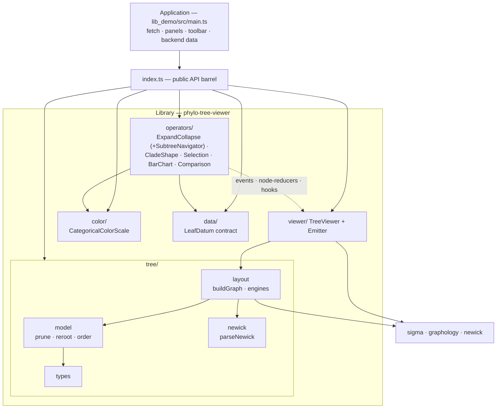
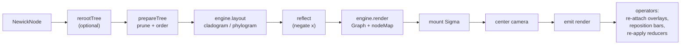
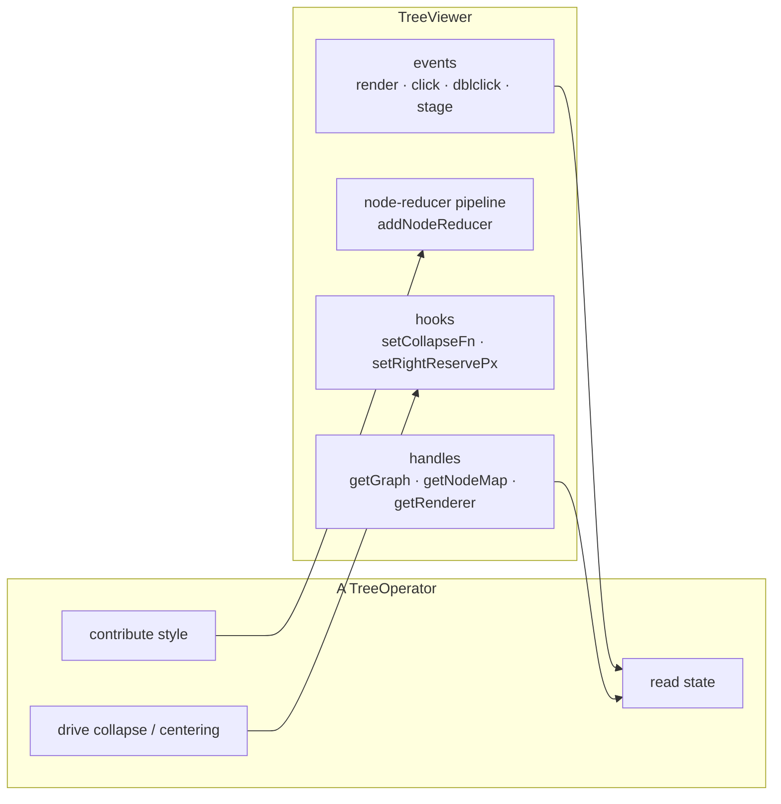

# Phylogenetic Tree Visualization Library

A framework-agnostic TypeScript library for rendering and interacting with
phylogenetic trees, built on [Sigma.js](https://www.sigmajs.org/) (WebGL graph
rendering) and [graphology](https://graphology.github.io/) (graph data model).
It is designed to be reused across projects: the application feeds it a tree as
plain data and attaches the interactions it needs.

> **Maintenance note (for the author):** this file is the single source of
> truth for what the library does. It must be updated whenever the library
> changes — new modules, options, operators, events, data contracts, or
> behavioural changes. Treat it as part of the implementation, not an
> afterthought.

---

## 1. Purpose & scope

The library renders a single phylogenetic tree per **viewer** instance as a
rectangular dendrogram (cladogram or phylogram), and supports a composable set
of **operators** for interaction (collapse/expand, selection, per-leaf bar
charts). Multiple viewers are fully independent, so two trees can be shown side
by side and compared (including one reflected to face the other).

Input is a plain `NewickNode` object (the shape produced by parsing Newick, but
equally a JSON object a backend could send directly). The library performs **no
network I/O** — fetching/loading is the application's responsibility. This keeps
the library project-agnostic and is the key boundary that makes it reusable.

---

## 2. Design principles

- **Library vs application boundary.** This is a standalone npm package
  (`phylo-tree-viewer`); everything in it is reusable and backend-agnostic. The
  demo application (`../lib_demo/`) is the only project-specific glue: it fetches
  dataset files, builds panels, wires the toolbar, and supplies isolate data. The
  dependency arrow points one way: `app → lib`. No library module imports the app
  — verified: nothing under `src/` imports anything outside it, which is what
  makes this package publishable.
- **Data in, not fetch.** The library accepts data (trees, isolate counts,
  colors) through constructor options and setters. It never fetches.
- **Composable operators.** Each interaction is an independent operator in its
  own file. Operators communicate with the viewer only through its public
  surface — events, the node-reducer pipeline, the collapse hook, and the
  right-reserve hook — so any subset can be attached to any viewer, and two
  viewers stay independent.
- **Extensible layout.** New layout styles are added by implementing a
  `LayoutEngine` and registering it; the rest of the pipeline is untouched.
- **Structure-preserving transforms.** Operations that reorganize the tree
  visually (sibling ordering / "branch rotation", reflection) never alter
  topology, parent/child links, or branch lengths — only the visual
  arrangement — so the displayed tree is always a legal representation of the
  input.
- **Single public entry point.** Consumers import from `./lib` (the barrel in
  `index.ts`); internal module paths are private.

---

## 3. Architecture & module map

```
phylo-tree-viewer/src/
  index.ts                  Public API barrel — the only import surface consumers use.
  presentation/             Everything that renders or reacts to a tree.
    tree/
      types.ts              Core types: NewickNode, LayoutMode, IsCollapsed, ChildOrder.
      model.ts              Pure tree ops: metrics, traversal, re-rooting, pruning, ordering.
      newick.ts             parseNewick — forest-aware Newick string → NewickNode.
      layout.ts             buildGraph + LayoutEngine registry (cladogram/phylogram).
    viewer/
      tree_viewer.ts        TreeViewer — the Sigma-backed renderer host.
      emitter.ts            Tiny typed event emitter.
    color/
      color_scale.ts        Categorical (shared category colors) + Sequential (value→color) scales.
    data/
      leaf_data.ts          Backend-driven per-leaf data contract (LeafDatum etc.).
      comparison.ts         Comparison data contract + node keyers (keyByClade/keyByName).
    operators/
      operator.ts           TreeOperator interface (attach/detach contract).
      expand_collapse.ts    ExpandCollapseOperator — collapse/expand; incremental & subtree modes.
      subtree_navigator.ts  SubtreeNavigator — drill-in stack behind subtree mode (not an operator).
      clade_shape.ts        CladeShapePresenter — collapsed clades as leaf-scaled wedges.
      selection.ts          SelectionOperator — click + drag-box selection.
      barchart_presenter.ts BarChartPresenter — per-leaf stacked composition bars.
      comparison.ts         ComparisonOperator — branch/node difference coloring + navigation.
  performance/              Keeping large trees affordable. No tree/Sigma/API knowledge.
    cache_entry.ts          CacheEntry<T> — intrusive LRU entry + tier ("warm" | "rendered").
    double_linked_list.ts   DoubleLinkedList<T> — intrusive DLL (O(1) move-to-front / evict-tail).
    cache_manager.ts        CacheManager<T> — generic byte-budgeted LRU with a two-queue tier system.
  config/
    config.ts               Config-driven bootstrap: Config type + createViewer/createComparison.
  config.example.jsonc      Example (general) config file (JSONC — fields annotated with allowed values); ships as the config schema-by-example.
```

The two top-level layers are the architectural split: `presentation/` decides
what a tree *looks like* and how it responds; `performance/` decides what stays
in memory. `index.ts` and `config/` sit above both because they span them.

**Status:** the `performance/` layer is exported but **not yet consumed** — the
viewer still holds whole trees, bounded by `maxNodes` (§5). The domain layer that
would bind the cache to trees + an app-supplied fetch (`TreeComparisonCache` in
`cache_strategy/tree-cache-manager-architecture.md`) is deliberately not written
yet. Note that doc specifies it calling `fetch()` directly; that must become an
injected callback to keep the "never fetch" boundary (§2).

### 3.1 Layering & dependencies

The dependency arrow points one way: `application → lib`, and within the lib,
operators/viewer depend on the tree/color/data layers, never the reverse.



### 3.2 Build & render pipeline

What happens on `setTree(...)` or any config change (`rerender()`):



### 3.3 Operator ↔ viewer channels

Operators never touch each other; they coordinate only through the viewer's
three public channels, which is what keeps them independent and composable.



---

## 4. Core data model (`tree/types.ts`)

```ts
interface NewickNode {
  name: string;
  length?: number;          // branch length (to parent)
  branchset?: NewickNode[]; // children; absent/empty ⇒ leaf
  category?: string;        // optional identifier for bar charts; defaults to name
  metadata?: Record<string, string | number | null>; // per-leaf fields for filtering (§8.2)
  collapsed?: boolean;      // set by prepareTree when a clade was truncated as collapsed
  origin?: NewickNode;      // set by prepareTree: back-ref to the original (un-pruned) node
}

type LayoutMode = "phylogram" | "cladogram";

type IsCollapsed = (node: NewickNode) => boolean;   // collapse predicate
const NEVER_COLLAPSED: IsCollapsed;                 // default: nothing collapsed

type ChildOrder = (a: NewickNode, b: NewickNode) => number;  // sibling comparator
```

- **Leaf identifier** (used to bind bar-chart data and colors) is
  `node.category ?? node.name`.
- **`metadata`** carries arbitrary backend-supplied fields on a leaf (sampling
  date, source, host, …). The library never fetches or interprets them — the
  full isolate store stays on the backend; only the fields relevant to the
  current subtree ride along on its leaves, where the metadata filter (§8.2)
  can test them.
- `IsCollapsed` is a predicate, not a set, so the collapse operator can key
  state however it likes (it uses stable structural IDs — see §9.1).
- `ChildOrder` defines the vertical order of sibling clades. Reordering siblings
  is a *branch rotation*: structurally legal, never changes topology.

---

## 5. Tree model operations (`tree/model.ts`)

Pure, side-effect-free functions over `NewickNode`. Independent of Sigma/DOM.

**Metrics & traversal**
- `maxRootDist(node)` — maximum root-to-leaf distance (sum of branch lengths).
- `maxDepth(node)` — maximum depth in edges (root = 0).
- `subtreeSize(node)` / `countLeaves(node)` — number of leaves under a node.
- `getSubtreeLeaves(node)` — all leaf nodes under (or equal to) a node.

**Re-rooting**
- `rerootTree(tree, targetName)` — returns a **new** tree re-rooted on the edge
  leading to the named node; splits that edge's length evenly between the two
  new branches. Returns `null` if the name is absent or already the root. Does
  not mutate the input.

**Pruning + ordering**
- `prepareTree(node, isCollapsed, leafBudget, order?)` — the core pre-layout
  transform. Two independent concerns:
  - **Selection** (which clades survive `leafBudget`): always favours larger
    subtrees, so the displayed subset stays representative. `leafBudget` is a
    leaf-count budget, split among siblings. This is density pruning, not a
    structural change.
  - **Ordering** (vertical order of survivors): the modular `order` comparator,
    default `orderByName`. A structure-preserving branch rotation.
  - Also collapses degree-1 chains (merging branch lengths) so depth reflects
    real branching, and marks collapsed clades as terminal nodes.
  - Stamps each output node with an `origin` back-reference to the original node
    it was cloned from, so operators keyed on the original tree (e.g. the
    Expandor/Collapsor, §9.1) can map a displayed node back to its source.
- `orderByName` *(default)* — ascending lexicographic ladderize. Orders siblings
  by a representative string key: the node's own name if it is *informative*
  (contains an alphanumeric — e.g. a goeBURST ST id), otherwise the
  lexicographically smallest leaf name in its subtree. Placeholder internal-node
  names (our NJ/UPGMA exports mark unnamed internals as `_`) are treated as
  absent, so ordering falls through to the leaves rather than keying every
  internal node on the same `_`. Comparison uses `localeCompare` with
  `numeric: true`, so it works
  for **any** labels — numeric ids, strain names, or mixed — keeping embedded
  numbers in natural order (`st2` before `st10`) while still sorting non-numeric
  labels lexicographically. This is the safe default because, unlike
  `orderByNumeric`, it never collapses non-numeric names into a single bucket.
- `orderByNumeric` — ascending numeric ladderize. Orders siblings by a
  representative numeric key: the node's own numeric name if present (e.g. a
  goeBURST ST id on an internal clade), otherwise the smallest numeric leaf id
  in its subtree. Non-numeric names sort last (fall back to +Infinity). Prefer
  `orderByName` unless labels are guaranteed numeric.
- `orderBySizeDesc` — largest-subtree-first (the pre-ordering default).

---

## 6. Newick parsing (`tree/newick.ts`)

- `parseNewick(text): NewickNode` — pure (string in, tree out).
- **Forest-aware.** Some inputs (goeBURST output) are a *forest*: many
  `;`-separated components — real trees plus thousands of singleton STs — on one
  line. The underlying parser returns only one tree, so `parseNewick` splits the
  components itself and returns the **largest** one (most leaves), skipping bare
  singletons. Single-tree inputs (NJ/UPGMA) pass through unchanged.

---

## 7. Layout pipeline (`tree/layout.ts`)

Turns a `NewickNode` tree into a renderable graphology `Graph` plus a lookup
from real graph-node IDs to positioned `LayoutNode`s. Knows nothing about Sigma,
interaction, or DOM.

**`buildGraph(tree, isCollapsed?, maxNodes?, layoutMode?, hideInternalNodes?, rerootOn?, reflect?, order?): BuiltGraph`**

Pipeline: optional re-root → `prepareTree` (prune + order) → compute layout via
the selected engine → optional horizontal reflection (negate every node's x) →
render nodes + connector edges into the graph → build the `id → LayoutNode` map.

```ts
interface BuiltGraph { graph: Graph; nodeMap: Map<string, LayoutNode>; }

interface LayoutNode {
  id: string; label: string; x: number; y: number;
  isLeaf: boolean; isCollapsed: boolean; named: boolean;
  children: LayoutNode[]; source: NewickNode;  // the (pruned) source node
}
```

**Layout engines**
- `LayoutEngine` interface: `layout(prepared, ctx)` computes positions;
  `render(graph, root, hideInternalNodes, ctx)` adds nodes/edges.
- `LAYOUT_ENGINES: Record<LayoutMode, LayoutEngine>` — the registry. Add a new
  style by implementing `LayoutEngine` and adding an entry; nothing else
  changes.
- Built-in rectangular engine (`makeRectEngine`):
  - **cladogram** — x from depth (equal spacing per level).
  - **phylogram** — x from cumulative (clamped) branch length.
  - **Leaf alignment.** All terminal tips (leaves and collapsed clades) are
    placed at a common x (the right edge of the 0–100 span) so they line up in a
    column and bar charts share a baseline. Internal nodes keep their
    depth/distance x.
  - **Branch-length clamping.** A single very long branch (e.g. an outgroup
    stem) is capped at ~8× the median branch so it can't dominate the
    phylogram scale.
  - **Connectors.** Horizontal/vertical dendrogram lines are drawn via invisible
    connector nodes (`v_*`, `h_*`), which are excluded from `nodeMap`. Each
    connector edge carries a `nodeId` attribute naming the real node it
    represents (child for a horizontal, parent clade for a vertical fork), so
    operators can style branches even though the endpoints are helper nodes.
  - Vertical bars appear only where a node truly branches (≥2 children).

**Reflection.** `reflect` negates every node's x after layout, before render, so
the whole dendrogram flips (root on the right, tips on the left). Because the
graph coordinates themselves are mirrored, edges, connectors, and Sigma's
coordinate conversion all stay consistent. (Sigma has no built-in
mirror/reflect — its camera only pans, zooms, and rotates.)

> **Extension point.** `LAYOUT_ENGINES` is how a fundamentally different
> representation gets added without touching the pipeline — a **network/MST
> engine for goeBURST** is the concrete case (§16). Positioning lives entirely in
> the engine; what an engine does *not* abstract is the bar presenter and
> right-reserve centering (both assume a left↔right tip column) and the collapse
> model (which assumes a rooted hierarchy), so a non-hierarchical engine needs
> those generalised too.

---

## 8. The viewer (`viewer/tree_viewer.ts`)

`TreeViewer` is the core, interaction-agnostic host. It owns the Sigma renderer,
the graphology graph, the layout state, and a composable node-reducer pipeline.
It does **not** implement collapse, selection, or bar charts — those are
operators that attach to it.

**Construction**
```ts
new TreeViewer(container: HTMLElement, options?: TreeViewerOptions)

interface TreeViewerOptions {
  layoutMode?: LayoutMode;     // default "cladogram"
  maxNodes?: number;           // leaf budget, default 200
  hideInternalNodes?: boolean; // default true
  rerootOn?: string;           // outgroup leaf/clade name
  fitPadding?: number;         // zoom-out margin after auto-fit, default 0.3
  reflect?: boolean;           // horizontal mirror, default false
  childOrder?: ChildOrder;     // sibling order, default orderByName
  suppressContextMenu?: boolean; // swallow the native menu in-container, default true
}
```

**Data / config methods**
- `setTree(tree)` / `getTree()`
- `setLayoutMode(mode)` / `getLayoutMode()`
- `setReflect(reflect)` / `isReflected()`
- `setChildOrder(order)`
- `reroot(name | undefined)`
- `setMaxNodes(n)`
- `setHideInternalNodes(hide)`
- `setCollapseFn(fn | null)` — install the collapse predicate (used by the
  collapse operator).
- `setFilter(predicate)` / `clearFilter()` / `getFilter()` — the metadata filter
  (§8.2).

**Handles for operators**
- `getContainer()`, `getRenderer()`, `getGraph()`, `getNodeMap()`.

**Selection → structure** (turn selected graph-node ids back into tree structure)
- `leavesOf(ids)` — the concrete leaf **names** a selection stands for, unfolding
  any collapsed clade to the hidden isolates it represents (via each node's
  `origin`). The clean input for "fetch/aggregate the selection": pass
  `selection.getSelected()` straight in.
- `mrcaOf(ids)` — the graph id of the most-recent common ancestor of the selected
  nodes (`null` if none known). Feed a leaf selection in and the result straight
  to `expandCollapse.collapseNodes([...])` to fold the clade around it.

  These keep the app from reaching through `getNodeMap().get(id).source` and its
  `origin`/clone internals: keys cross the boundary, structure does not. Backed
  by the pure `leafNamesOf` / `mrcaId` in `tree/navigation.ts`.

**Node- & edge-reducer pipelines**
- `addNodeReducer(reducer): () => void` — register a reducer; returns an
  unregister fn. All reducers are folded (in order) into Sigma's single
  `nodeReducer`, so independent operators contribute styling (selection
  highlight, label hiding, comparison coloring) without clobbering each other.
- `addEdgeReducer(reducer): () => void` — the symmetric pipeline for branches,
  folded into Sigma's `edgeReducer`. Used to color branches by comparison value.
- `applyReducers()` / `applyEdgeReducers()` — re-apply the composed pipelines
  (operators call these after state changes).

**Camera / centering**
- After every (re)mount the viewer centers the tree with a margin (`fitPadding`)
  so labels/bars aren't clipped.
- `setRightReservePx(px)` — operators report how many pixels of content sit on
  the leaf side (labels + bars); the viewer shifts the tree by half that so the
  combined content is centered. The shift direction flips when reflected.

**Rendering**
- `rerender()` — rebuild the graph from current state, kill+remount Sigma, emit
  `render`. Called automatically by the config setters.

> **Sigma container caveat.** `Sigma.kill()` empties the container (removes all
> child nodes) on every rebuild. Operators that add DOM overlays (bar charts,
> selection box) must re-attach them on each `render` event — the built-in
> operators do this.

**Events (`ViewerEvents`)** — subscribe via `viewer.events.on(type, handler)`:
- `render { renderer, graph, nodeMap }` — after every rebuild + remount.
- `treeChanged { tree }` — when `setTree` replaces the tree.
- `clickNode { node }`, `doubleClickNode { node }` (synthesized — Sigma has no
  native dblclick), `clickStage { x, y }`, `enterNode { node }`, `leaveNode {}`,
  `filterChanged { filter }` (§8.2), `destroy {}`.
- `rightClickNode { node, x, y, original }` / `rightClickStage { x, y, original }`
  — the seam an app-drawn **context menu** hangs off. `x`/`y` are viewport
  coordinates for positioning; `original` is the DOM event. Hit-testing is
  Sigma's, i.e. by marker size, so with `hideInternalNodes` the reachable nodes
  are leaves and collapsed clade markers — same as `clickNode`.

  **The native menu is suppressed inside the container** (`suppressContextMenu`,
  default true) so an app-drawn menu isn't covered by the browser's. Note where
  that listener lives: on the **viewer's container**, not on Sigma's right-click
  event. Sigma listens on its own mouse layer, which is a *sibling* of the
  operator overlays — anything opting into pointer events swallows the event
  before Sigma sees it, and the native menu would still pop there. Every overlay
  is click-through today, so this is insurance against the next one that isn't,
  and it also covers container area the mouse layer does not span.
  `destroy()` removes the listener, since the element can outlive the viewer.

  Scoped to the panel: right-clicks on toolbars, headers or a footer keep the
  native menu, and it's per viewer, so one panel can opt out (`false`) to keep
  e.g. "Save image as…". The event is emitted either way.

  Everything else a menu needs already exists — `selection.getSelected()`,
  `expandCollapse.collapseNodes/expandNodes`, `viewer.mrcaOf` / `leavesOf`, and
  `ec.getMode()` to gate incremental-only items.

### 8.2 Metadata filtering

Filter the **currently rendered** leaves by a predicate over their
`NewickNode.metadata` (§4). Intended for the architecture where the large
isolate/metadata store stays on the backend and each subtree response embeds the
relevant fields on its own leaves — the predicate runs against the metadata each
visible leaf already carries, never a full client-side dataset.

```ts
type LeafFilter = (
  metadata: Record<string, string | number | null>,
  leaf: NewickNode,          // also given, for name/category predicates
) => boolean;                // true = keep, false = filter out

viewer.setFilter((m) => m.year != null && Number(m.year) >= 2015);
viewer.clearFilter();
```

- **Presentation-only, no rebuild.** `setFilter`/`clearFilter` re-apply the
  node-reducer pipeline and emit `filterChanged`; they do **not** rebuild or
  re-layout the graph. So a filter only ever affects leaves already on screen —
  it never "unhides" a leaf pruned by the `maxNodes` budget or folded inside a
  collapsed clade. To widen the visible set, change the tree/collapse/budget
  first; the filter then narrows what remains.
- **Effect.** A failing leaf is dimmed (`FILTER_DIM_COLOR`) with its label
  cleared; matching leaves, internal nodes, and connectors are untouched. The
  dim is folded in **after** all operator reducers, so it wins over e.g. a
  selection highlight. Only leaves are ever filtered.
- **`passesFilter(leaf)`** (`true` when no filter is set) is the hook overlay
  operators use to stay consistent with the node dimming. The `BarChartPresenter`
  listens for `filterChanged` and, on rebuild, gives a filtered-out leaf **no
  bar** and excludes it from the `maxTotal` used to scale bar lengths — so the
  composition bars always match the leaves still shown. No aggregate "popover"
  exists in the library: composition is per-leaf, so "respect the filter" means
  the suppressed leaves drop out, not a recomputed cross-leaf tally.
- The app owns the filter *UI* (inputs, chips) and calls `setFilter`; the library
  supplies the mechanism and the metadata carrier only.

`destroy()` tears down the renderer and clears subscriptions.

---

### 8.1 Click, double-click, and Sigma's defaults

Sigma emits **no node-level double-click**: its mouse captor emits a raw
`doubleClick` with coordinates but no node. The viewer therefore *synthesises*
node double-clicks — two `clickNode`s on the same node within
`DOUBLE_CLICK_MS` (350) become `doubleClickNode`, and the second click is not
re-emitted as a single, so operators never see both.

Sigma also **zooms on double-click by default**, right after emitting:

```js
this.emit("doubleClick", mouseCoords);
if (mouseCoords.sigmaDefaultPrevented) return;
// … camera.animate({ ratio: ratio / doubleClickZoomingRatio })
```

Double-clicking a *node* is the library's gesture (expand/collapse, or drill in —
§9.1), so the viewer hooks the captor and calls `preventSigmaDefault()` whenever a
node is hovered; otherwise every toggle would also lurch the camera. Double-click
on empty **stage still zooms**, which is the useful half of the default. Since the
captor's event carries no node, the viewer tracks the hovered node (`enterNode` /
`leaveNode`) to attribute the gesture.

Note the two windows differ — Sigma's `doubleClickTimeout` is 300ms, the viewer's
synthesis window is 350ms — which is harmless: below 300 Sigma would zoom and we
prevent it; between 300–350 we toggle and Sigma never treated it as a double-click
at all; above 350 neither does. There is no gap where Sigma zooms unclaimed.

---

## 9. Operators

`TreeOperator` is the contract: `{ name, attach(viewer), detach() }`. Each
operator is independent; attaching the same set to two viewers gives two
independent panels that both support every operation.

### 9.1 ExpandCollapseOperator (`operators/expand_collapse.ts`)

Collapse/expand on **every** internal node, not only named clades — the
navigation mechanism for the difference-driven drill-down (summarize the tree,
then expand the clades that differ). It assigns a stable structural ID to each
node (path-based: root `r`, i-th child `p.i`) and keys collapse state on those
IDs, so state survives the repeated graph rebuilds caused by layout/prune/hide
changes.

- **A trigger always exists.** Double-click is the operator's own trigger, but
  Sigma hit-tests by marker size and `hideInternalNodes` (§8) draws internal
  nodes at size 0 — so there would be nothing clickable at all. The operator
  installs a node reducer giving every *actionable* clade an invisible hit area
  (`HIT_SIZE`, transparent). Right-click (§8) hit-tests the same way, so this is
  also what lets a context menu land on a clade.
- **Actionability is public.** `actionFor(layoutNode)` returns `"expand"`,
  `"collapse"` or `null` — the per-mode rule the hit area is derived from, exposed
  so an app-drawn affordance (menu item, toolbar, tooltip) offers exactly what the
  gesture would do, rather than re-deriving it. `collapseMinLeaves` (default 3)
  keeps tiny forks from being collapse targets.
- **Origin-mapped toggling (correctness fix).** Pruning clones the tree, so a
  displayed node is not identity-equal to its source; every prepared node now
  carries an `origin` back-reference (set by `prepareTree`) and the operator
  resolves clicks through it before the ID lookup. Previously the toggle looked
  up the *clone* in the original-keyed WeakMap and silently failed for cloned /
  unnamed nodes — so collapse didn't actually work. The collapse *predicate*
  (evaluated on original nodes during pruning) and the *toggle* now share the
  same ID.
- **In-place drill-down, `expandDepth` levels at a time.** Expanding a clade
  opens it `expandDepth` levels (default 1) **in place** — the surrounding tree
  stays on screen — and re-folds below, so you drill down in controlled steps
  instead of exploding the subtree to the leaves. On strictly binary trees
  (UPGMA/NJ) 1 level is a single bifurcation, so 2-3 usually reads better.
  Collapsing folds the entire subtree back into one tip in a single click.
  `openSubtree(node, levels)` exposes this directly; `getExpandDepth()` /
  `setExpandDepth(n)` tune it at runtime.
  - This is the **in-place** expand model. §9.3 FocusOperator is the alternative
    (drill in as if it were a new tree). They compose — see the comparison there.
- **Depth control (one primitive, both directions).** `setDepth(depth)` shows the
  tree down to `depth` (root = 0): every clade at that depth is collapsed and
  everything above it is expanded. Because it rebuilds the collapse set from
  scratch rather than only adding to it, it both **summarizes** (a smaller depth
  folds clades back up) and **expands to a depth** (a larger one opens them) —
  there is no separate `expandToDepth`. Walks the *original* tree, so it is
  unaffected by display-side pruning; `depth` is clamped to >= 0.
  - `getDepth()` returns the depth currently shown, or **null** once clades have
    been toggled individually (or `expandAll()` ran) and the view no longer
    matches a uniform depth cut — a UI can use this to mark its control stale.
  - `getInitialDepth()` reads back the configured opening depth.
  - `resetDepth()` returns to `initialDepth` (falling back to `collapseAll()`
    when none is configured); `collapseAll()` = `setDepth(1)`.
  - `collapseToDepth(depth)` is a **deprecated** alias for `setDepth`.
- **Batch collapse from a selection.** `collapseNodes(ids)` / `expandNodes(ids)`
  take **graph-node ids** (the keys `SelectionOperator.getSelected()` returns),
  resolve them to their source clades via the viewer's node map, and act on all
  of them in a **single rerender** — so "collapse only the selected clades"
  (instead of `collapseAll()`) costs one rebuild, not one per node. Leaves,
  already-collapsed clades, and unknown ids are ignored, and nothing rerenders if
  the collapse set didn't change. To fold the clade around a *leaf* selection,
  combine with the viewer's `mrcaOf`: `collapseNodes([viewer.mrcaOf(sel)!])`.
  Incremental-mode semantics; in `"subtree"` mode collapse means "drill back out".
- **Open summarized.** Via config `initialDepth`, the tree opens at a chosen
  depth and is expanded into. Re-applied on every `treeChanged`.
- Installs an `isCollapsed` predicate on attach; rebinds (and re-applies
  `initialDepth`) on `treeChanged`. Also toggles on `doubleClickNode`, unless
  `toggleOnDoubleClick: false` yields that gesture to FocusOperator (§9.3) — the
  config layer does this automatically when both are enabled. With the gesture
  yielded, the app drives the operator through its public methods (toolbar,
  context menu, `collapseNodes` over a selection).
- Options: `collapseMinLeaves`, `depth` (sets both depths), `initialDepth`
  / `expandDepth` (override either half), `toggleOnDoubleClick`.
- API: `collapse(node)`, `expand(node)`, `collapseNodes(ids)`, `expandNodes(ids)`,
  `actionFor(layoutNode)`, `toggleFromSource(layoutNode)`,
  `openSubtree(node, levels)`, `getExpandDepth()`, `setExpandDepth(n)`,
  `getMode()`, `setMode(m)`, `back()`, `resetSubtree()`, `goTo(i)`, `getPath()`,
  `canGoBack()`, `setOnPathChange(cb)`,
  `setDepth(depth)`, `getDepth()`, `getInitialDepth()`, `resetDepth()`,
  `collapseAll()`, `expandAll()`, `getCollapsed()`, `isCollapsed(node)`,
  `idOf(node)`.
- **Interaction with `maxNodes`.** The viewer's `maxNodes` leaf budget (§5) is a
  *separate* summarizer applied during layout, favouring the largest subtrees. A
  depth whose cut yields more clades than the budget will be truncated by it, so
  the view stops being a clean depth cut. Raise `maxNodes` if you need deep cuts.
- Note: re-rooting clones the tree, so collapse of *unnamed* nodes does not
  carry across a reroot (named clades survive).
- Not adopted from Cytoscape's expand-collapse plugin: **edge/meta-edge
  collapsing** (for parallel edges in general graphs — trees have none) and the
  **compound-node** model (our subtree-hiding model is simpler and correct for
  trees). Its **visible `±` cue** was adopted for a time and then removed (§19):
  the affordance belongs to the application's own UI (context menu, toolbar), and
  the library keeps only the mechanism — `actionFor` tells the app what a clade
  offers, so the affordance can be drawn without duplicating the rule.

### 9.2 CladeShapePresenter (`operators/clade_shape.ts`)

Draws each **collapsed clade as a triangular wedge** — the standard phylogenetics
convention for "a clade is folded up here" — instead of the generic circular
marker, and **scales the wedge with the number of leaves it hides**, so a summary
tip carries a sense of how much tree is behind it.

- **Decoupled from collapse.** Reads `isCollapsed` off the layout nodes the viewer
  already publishes (`getNodeMap()`), so it needs no reference to §9.1 — or to
  whatever else drives collapse (a bare `setCollapseFn` works). Attach it or don't;
  nothing else changes. A good illustration of the operator contract (§2, §3.3):
  two operators cooperating on the same nodes with zero knowledge of each other.
- **Size ∝ log2(leaves).** Half-height ramps `minHalfHeight` → `maxHalfHeight` as
  log2(leaves)/log2(`saturateAt`), so a clade of 8 and one of 4,000 stay visually
  distinct instead of both pinning to the maximum. Leaf counts come from the
  clade's `origin` (§4), i.e. the *true* subtree, not the pruned one. Hovering a
  wedge shows the count.
- **The scale calibrates itself.** `saturateAt` is the top of the scale — the leaf
  count that draws at max height, above which everything saturates. It **defaults
  to the leaf count of the tree in view**, so the biggest possible clade maps to
  the tallest wedge and the differences spread across the full pixel range. This
  matters: a fixed default (it was 512) sits far below a real tree's scale — on a
  17.6k-leaf tree every depth-3 clade holds ~2,200 leaves, all saturate, and every
  wedge renders identical, destroying the encoding. Memoized on tree identity, so
  the tree is walked once per load, not per frame. In subtree mode the scale
  re-calibrates on drill-in, keeping heights relative to the tree you're viewing.
  Set it explicitly only to compare wedge heights *across* different trees.
- **Orientation.** Wedges point back toward the root, and mirror automatically on
  reflected panels (`towardRoot` inverts it).
- **Color** follows the node's own graph color by default, so it stays in step
  with the rest of the palette; `color` pins it.
- **Marker handoff.** `hideMarker` (default true) installs a node reducer making
  the collapsed node's marker **transparent** — not size 0 — so the wedge replaces
  the circle rather than stacking on it. Size is deliberately preserved: Sigma
  hit-tests by size, this overlay is `pointer-events: none`, and zeroing it would
  silently destroy the clade's double-click target (§9.1).
- DOM overlay (like §9.3's bars) at `zIndex: 12` — a CSS-border triangle
  repositioned per frame on `afterRender`, rather than a custom WebGL node
  program: far less code, and it composes with the other overlays. Constant
  screen size while zooming.
- Options: `towardRoot`, `length`, `minHalfHeight`, `maxHalfHeight`, `saturateAt`,
  `color`, `hideMarker`.

### 9.3 SelectionOperator (`operators/selection.ts`)

Two selection gestures:
- single click on a node selects just that node;
- when drag-select is enabled, a click-drag-click on empty canvas selects every
  real (non-connector) node whose graph coordinates fall in the rectangle.

Highlight is contributed via the node-reducer pipeline (so it coexists with
other operators). Each viewer gets its own instance, so panels select
independently.

```ts
new SelectionOperator(options?: SelectionOptions)
interface SelectionOptions {
  dragSelectEnabled?: boolean;                 // default false
  onSelectionChange?: (selected: string[]) => void;
}
```
- API: `setDragSelectEnabled(on)`, `isDragSelectEnabled()`, `getSelected()`,
  `clearSelection()`, `setOnChange(fn)`.

**What a selection contains.** Not just leaves. A click hit-tests by marker size,
so it reaches **leaves and collapsed clade markers** (expanded internal nodes are
size 0 under `hideInternalNodes` and aren't clickable); the drag-box is
coordinate-based, so it also sweeps in internal nodes within the rectangle. Both
gestures return a set of **graph-node ids** (`getSelected()`), plus the same list
through `onSelectionChange`.

**Acting on a selection.** The operator only *tracks* the set — deciding what a
right-click menu or toolbar does with it is application policy. The library gives
you the id→structure bridge on the viewer so the app never touches internals:
`viewer.leavesOf(sel)` for the concrete isolates (a selected collapsed clade
unfolds to its hidden leaves — the input for a backend fetch or a composition
aggregate), and `viewer.mrcaOf(sel)` + `expandCollapse.collapseNodes([...])` to
collapse the clade around a selection (§8, §9.1).

### 9.4 BarChartPresenter (`operators/barchart_presenter.ts`)

Renders a per-leaf **stacked composition bar** in a DOM overlay above the Sigma
canvas (pointer-events: none, so selection/collapse still work through it). Bars
are repositioned every Sigma frame, so they track pan/zoom.

- **Length** is proportional to the leaf's total magnitude, mapped by `scale`:
  `"linear"` (total ÷ max) or `"log"` (`log1p` — compresses heavy tails).
- **Composition.** Each bar is one flex segment per category, sized by value. A
  single-value datum renders as one segment. Segment order reverses when the
  tree is reflected so the stack mirrors too.
- **Color is semantic** — each segment is colored by
  `segment.color ?? colorScale.color(segment.key)`. Sharing one
  `CategoricalColorScale` across presenters makes the same category the same
  color in every tree.
- **Labels.** The presenter draws every leaf label itself in the overlay (no
  collision culling, so every tip is labelled), on the left when reflected and
  the right otherwise. While bars are on, Sigma's native leaf labels are blanked
  via a node reducer to avoid duplicates; when bars are off they return.
- **Centering.** Reports its band width (gap + widest label + offset + longest
  bar) to the viewer via `setRightReservePx`, so the tree is shifted to keep
  tree + bars centered.
- **Respects the metadata filter (§8.2).** Listens for `filterChanged` and, on
  rebuild, draws no bar for a filtered-out leaf and drops it from the `maxTotal`
  that scales bar lengths — keeping the bars aligned with the leaves still shown.

```ts
new BarChartPresenter(options?: BarChartOptions)
interface BarChartOptions {
  data?: Map<string, LeafDatum>;     // primary backend source, keyed by identifier
  dataOf?: LeafDataProvider;         // function form; consulted when `data` misses
  counts?: Map<string, number>;      // single-value shorthand (⇒ { total })
  countOf?: (id, leaf) => number;    // function form of counts
  scale?: BarScale;                  // "linear" | "log", default "linear"
  maxBarWidth?: number;              // px, default 60
  barHeight?: number;                // px, default 8
  offset?: number;                   // px gap before bar, default 8
  colorScale?: CategoricalColorScale;// shared scale; default private
  colorOf?: (key) => string;         // overrides colorScale
  enabled?: boolean;                 // default true
}
```
- Data resolution order: `data` → `dataOf` → `counts` → `countOf` → deterministic
  synthetic fallback (so the demo renders without a backend).
- API: `setEnabled(on)`, `isEnabled()`, `setScale(s)`, `getScale()`,
  `setData(map)`, `setCounts(map)`.

### 9.5 ComparisonOperator (`operators/comparison.ts`)

Presents backend-computed tree differences, phylo.io-style. The library does
**not** compute the metric (RF, BCN/Jaccard, weighted RF, …) — the backend
does. The operator supports **two presentation modes** (`mode`), because
different metrics report differences differently:

> **Configured once, for all panels.** `comparison` is a **top-level** `Config`
> key, not a per-panel `operators` entry: a comparison is a statement about the
> panels *together*, so every panel is built from the same block. Per-panel
> configuration allowed states that cannot be true at once — one side colouring
> differences while the other doesn't — and, worse, different `keyBy` values,
> whose key spaces can never correspond, which silently disabled cross-tree
> highlighting. The *operator instance* is still per viewer (it folds reducers
> into that viewer's pipeline); only the settings are shared.

- **`"gradient"` (default)** — a per-node/branch *magnitude*. Following the
  phylo.io convention, a branch is colored by the value on its **child node**
  (the branch represents that node's clade/bipartition), through a shared
  `SequentialColorScale`. Serves per-edge and per-leaf magnitude metrics alike.
- **`"membership"`** — a *set of nodes that differ*. Some metrics report not a
  magnitude but a partition: which nodes/clades are shared vs which differ. Every
  leaf shared by both trees is marked `equalColor`
  depending on whether its key is in the differing set. Leaf coloring is
  meaningful here (unlike gradient mode) precisely because the backend names the
  differing nodes rather than assigning a single leaf a bipartition magnitude.

> **Attribution.** The gradient branch-coloring model and the blue→yellow scale
> are adapted from **phylo.io** (© Clement Train & the Dessimoz Lab, MIT license
> — see §19). This is an independent reimplementation on Sigma/graphology; no
> phylo.io code is used.

- **Gradient coloring.** Registers an edge reducer and a node reducer, mapping
  value → color through a shared `SequentialColorScale`. Both the horizontal
  branch into a clade and that clade's **vertical fork** are colored (each edge
  is tagged in the layout with the real node it belongs to via a `nodeId`
  attribute). Branches without a value keep their default color (gray = no data).
  Leaf *markers* stay neutral (`leafColor`, default near-black), but the colored
  branches continue to the tips, so the colored path is unbroken root → leaf.
- **Membership coloring.** In `"membership"` mode the edge reducer is a no-op
  (branches revert to default), and the node reducer paints every node by
  membership and gives it a visible marker (`markerSize`, default 6 — internal
  markers are size 0 by default, so this is what makes the color show).
- **Key resolution.** A node's value/membership is looked up by a configurable
  `keyOf` (`keyByClade` default — canonical leaf-set; or `keyByName`), so it
  adapts to how the backend keys differences.
- **Legend & tooltip.** A corner legend that adapts to the mode — a gradient bar
  in `"gradient"`, two labeled swatches (different / equal) in `"membership"` —
  and a hover tooltip showing the node's key + value (gradient) or + `different`/
  `equal` (membership). Overlays are re-attached on each render.
- **Cross-tree navigation.** `link(peerOperator)` pairs the two panels'
  operators; clicking a node looks up its correspondent (via `correspondence`
  or same-key default) and asks the peer to center + blink-highlight it.

```ts
new ComparisonOperator(options?: ComparisonOptions)
interface ComparisonOptions {
  values?: ComparisonValues;          // Map<key, number>, backend-provided (gradient)
  valueFor?: ComparisonValueProvider; // function form (NB: not `valueOf`)
  keyOf?: NodeKeyOf;                  // keyByClade (default) | keyByName | custom
  scale?: SequentialColorScale;      // share across panels for consistent color
  colorEdges?: boolean;              // default true (gradient)
  edgeWidth?: number;                // px width of colored branches, default 3
  colorNodes?: boolean;              // default true (gradient; leaves stay neutral)
  leafColor?: string;                // neutral leaf color, default "#212529"
  mode?: ComparisonMode;             // "gradient" (default) | "membership"
  differing?: Iterable<string>;      // membership: set of differing node keys
  isDifferent?: DifferencePredicate; // membership: function form of `differing`
  equalColor?: string;               // membership, default "#0077bb"
  markerSize?: number;               // membership marker px, default 6
  membershipLabels?: [string, string];// [different, equal], default ["different","equal"]
  legend?: boolean;                  // default true (adapts to mode)
  legendLabels?: [string, string];   // gradient legend ends, default ["different","similar"]
  correspondence?: CorrespondenceMap;// cross-tree key map; default same-key
  enabled?: boolean;                 // default true
}
```
- API: `setValues(map)`, `setCorrespondence(map)`, `setMode(mode)`, `getMode()`,
  `setDiffering(keys)`, `setEnabled(on)`, `isEnabled()`, `link(peer)`,
  `highlightByKey(key)`.

---

## 10. Color scale (`color/color_scale.ts`)

`CategoricalColorScale` maps string keys (category / identifier) to colors,
assigning the next palette color on first sight and memoizing it.

- **Share one instance across views** to guarantee the same key is the same
  color everywhere — the first view to render a key fixes its color; others
  reuse it. Stronger than independent hashing (no collisions for the first
  `palette.length` keys; consistency doesn't depend on every view computing the
  same function).
- **Reading vs assigning.** `color(key)` **assigns on miss** — it is a write in
  disguise. `assignments(): ReadonlyMap<string,string>` is the safe read: a
  defensive copy, ordered by assignment (i.e. palette order), never mutating.
  Use it for legends; querying `color()` for an undrawn key would consume the next
  palette slot and recolor the very chart the legend describes.
- **Assignment is lazy**, so `assignments()` lists only keys drawn so far — and
  with `maxNodes` pruning (§5) that is a fraction of them. `prime(keys)` with the
  full key set up front makes the mapping complete and stable instead of growing
  as the user navigates.
- **Reachable from the app** via `ViewerHandle.colorScale` /
  `ComparisonHandle.colorScale` (§12) and `BarChartPresenter.getColorScale()`
  (§9.4) — the library owns this mapping, so it must publish it or apps duplicate
  the palette-walking. The legend *UI* itself is the app's (§2).
- **Palettes wrap.** `color()` takes `palette[next % palette.length]`, so once the
  keys outnumber the colors, two categories silently share one — no error, and a
  legend would show one swatch against two labels. The palette length is therefore
  a hard ceiling on how many categories can be honestly encoded.
- **Config `palette` is a delivery mechanism, not a fixed list.** It defaults to
  `DEFAULT_PALETTE` (16). An app whose category count is dynamic (e.g. filter
  combinations from a backend) should *generate* one to fit and pass it in at
  runtime — `createFromConfig(els, { ...config, palette: iwanthue(n) }, …)` — then
  `prime()` with the full key set. `config.example.jsonc` deliberately omits the
  key rather than shipping a stale literal.
- API: `color(key)`, `prime(keys)`, `assignments()`.
- `DEFAULT_PALETTE` — a 16-color categorical palette.

`SequentialColorScale` maps a **numeric** value to a color by interpolating
across color stops — used to color branches/nodes by a comparison value.

- `new SequentialColorScale({ stops?, domain? })`; `color(value)` (clamped to
  domain), `getDomain()`, `stopsHex()` (for a legend gradient).
- `DIFF_PALETTE` — a vivid green→yellow→red ramp (default stops); pass custom
  `stops` for any other spectrum.
- Share one instance across panels so equal values read as the same color.

---

## 11. Backend-driven leaf data (`data/leaf_data.ts`)

The contract the application uses to feed per-species isolate data. The library
defines the shape; the app fetches and supplies it. Two shapes are supported:

```ts
interface LeafSegment { key: string; value: number; color?: string }
interface LeafDatum   { total?: number; segments?: LeafSegment[] }
type LeafDataProvider = (identifier: string, leaf: NewickNode) => LeafDatum | undefined
```
- **Single value** — `{ total: n }` → one bar.
- **Composition** — `{ segments: [...] }` → stacked bar; total = sum of segment
  values (or explicit `total`).
- Colors come from the category `key` via the shared scale unless a segment sets
  an explicit `color`.
- Helpers: `datumTotal(datum)`, `datumSegments(datum, identifier)` (normalizes a
  single value to one identifier-keyed segment).
- **Join key.** A leaf binds to its datum by identifier = `category ?? name`
  (the ST id in the demo). *(Not yet configurable — planned: a selectable key
  function once the backend shape is fixed.)*

### 11.1 Comparison data (`data/comparison.ts`)

The contract for presenting backend-computed differences (used by the
`ComparisonOperator`).

```ts
type NodeKeyOf = (node: NewickNode) => string;
type ComparisonValues = Map<string, number>;
type ComparisonValueProvider = (key: string, node: NewickNode) => number | undefined;
type DifferenceSet = Set<string>;                // membership: keys that differ
type DifferencePredicate = (key: string, node: NewickNode) => boolean;
type CorrespondenceMap = Map<string, string>;   // own key → other tree's key
```
- **Keyers** (configurable, supports edge- or leaf-keyed metrics):
  - `keyByClade` *(default)* — canonical sorted leaf-set (bipartition). Robust
    for internal branches; standard for topology metrics; works for unnamed
    internals.
  - `keyByName` — the node's own name (leaf id / named clade).
- **Values** *(gradient mode)* — a `Map<key, number>` (or `valueFor(key, node)`
  function). A missing key means "no data" (branch keeps its default color).
- **Difference set** *(membership mode)* — a `Set<key>` (or `isDifferent(key,
  node)` predicate) naming the nodes that differ; everything else is "equal".
- **Correspondence** — optional cross-tree key map for navigation; when absent,
  the same key is assumed to correspond (exact clade/name match).

---

## 12. Config-driven bootstrap (`config/config.ts`)

A thin layer that turns a **plain config object** into a running view. It is the
"configured components, integrated as application actions" entry point: the app
loads a config (a bundled JSON file, or an endpoint later — the library doesn't
care), and this layer constructs the viewer(s) and attaches the operators.

**The library still never fetches and never reads a file.** This layer takes an
*already-parsed* config object plus a `providers` bundle carrying the
non-serializable parts (parsed trees + data callbacks). Where the data comes
from (API calls, response shapes), where the config comes from, and the page
layout (container elements, CSS) all stay in the app.

- **The config's shape chooses the factory:**
  - a `panels` array → `createComparison` (the linked, N-capable comparison view);
  - a bare `viewer`/`operators` block → `createViewer` (one panel).
  - `createFromConfig(containers, config, providers)` dispatches on which is present.
- **What the library owns here:** reading its config slice → constructing viewer +
  operators, the cross-panel `link()` pairing, and the **shared color scales**
  (one categorical scale for bar categories, one sequential scale for the
  comparison gradient), so a category / value reads as the same color in every
  panel.
- **What the app still owns:** fetching, API response shapes, loading the config,
  the container elements, page layout/CSS, and the toolbar (which calls the
  handles' public setters).

```ts
// Config = the serializable slice the library reads. A general app config may
// also carry app-owned keys (API routes, file sources, values); they're ignored.
interface Config {
  viewer?: ViewerConfig;          // single-viewer form …
  operators?: OperatorsConfig;
  panels?: PanelConfig[];         // … OR comparison form (a panel per tree)
  link?: boolean;                 // link panels for navigation (default true)
  palette?: string[];             // shared categorical palette across panels
  comparison?: {                  // ONE block, applied to EVERY panel (§9.5)
    enabled?: boolean; mode?: "gradient" | "membership";
    keyBy?: "clade" | "name"; domain?: [number, number];
    stops?: string[]; equalColor?: string;
    /* …all ComparisonOptions that are serializable */
  };
}
interface OperatorsConfig {
  expandCollapse?: boolean | {              // default true; object tunes it
    enabled?: boolean;
    mode?: "incremental" | "subtree";  // in-place growth, or clade-as-new-tree
    minLeaves?: number;                // subtree mode: min clade size to drill into
    collapseMinLeaves?: number;        // don't offer collapse below this size
    depth?: number;                    // the knob: opening cut AND levels per expand
    initialDepth?: number;             // override opening cut alone (root = 0)
    expandDepth?: number;              // override levels-per-expand alone
    toggleOnDoubleClick?: boolean;     // act on double-click too (per mode)
  };
  cladeShape?: boolean | {                  // default true; collapsed clades as wedges
    enabled?: boolean; towardRoot?: boolean; length?: number;
    minHalfHeight?: number; maxHalfHeight?: number; saturateAt?: number;
    color?: string; hideMarker?: boolean;   // saturateAt defaults to the tree's leaf count
  };
  selection?:  { enabled?: boolean; dragSelectEnabled?: boolean };
  barcharts?:  { enabled?: boolean; scale?: "linear" | "log"; /* …sizes */ };
  // NOTE: no `comparison` here — it is top-level on `Config` (see below).
}

// Providers = the non-serializable parts (the app owns fetching + shaping).
interface ComparisonProviders {
  trees: NewickNode[];                        // parsed by the app, index-aligned
  dataOf?: LeafDataProvider;                  // → bar composition
  valueFor?: ComparisonValueProvider;         // → gradient value
  isDifferent?: DifferencePredicate;          // → membership set
  differing?: Iterable<string>;
  onSelectionChange?: (sel: string[], panelIndex: number) => void;
  onNodeClick?: (node: string, panelIndex: number) => void;
}
```

```ts
const handle = createFromConfig([leftEl, rightEl], config, {
  trees: [treeA, treeB],           // app fetched + parsed these
  dataOf:   (id)  => toLeafDatum(apiResponse),
  valueFor: (key) => diffValues.get(key),
});
// Runtime "callbacks for dynamic changes" — the returned handles expose the
// live operators, so the app drives changes after construction:
handle.panels[0].operators.comparison?.setMode("membership");
handle.panels[1].operators.barcharts?.setScale("log");
```
- Returns a `ComparisonHandle { panels: ViewerHandle[]; destroy() }`; each
  `ViewerHandle` exposes `{ viewer, operators, destroy() }`.
- **`config.example.jsonc`** ships as the schema-by-example: the library keys
  (`panels`/`link`/`palette`) plus an illustrative `app` block (sources / API /
  values) that the library ignores, to show the app/library split. As JSONC, each
  field is annotated with its allowed values in `//` comments; the app strips the
  comments before `JSON.parse` (`main.ts`). `app.sources` splits into `trees`
  (keyed by panel id, each naming its `species`) and `isolated_data` (a list, one
  entry per species), plus `keys` / `segmentBy` / `joinColumn` naming which TSV
  columns are loaded, which one colours the bars, and which joins to a leaf.
- **npm:** the layer is structured to publish cleanly later, but packaging is not
  wired yet (see §16).

---

## 13. Public API (`index.ts`)

Everything a consumer needs is re-exported from `./lib`:

- **Model & data:** `NewickNode`, `LayoutMode`, `IsCollapsed`, `ChildOrder`,
  `NEVER_COLLAPSED`, `maxRootDist`, `maxDepth`, `subtreeSize`, `countLeaves`,
  `getSubtreeLeaves`, `rerootTree`, `prepareTree`, `orderByName`,
  `orderByNumeric`, `orderBySizeDesc`.
- **Newick:** `parseNewick`.
- **Navigation (selection → structure):** `leafNamesOf`, `mrcaId` (pure helpers
  behind the viewer's `leavesOf` / `mrcaOf`).
- **Layout:** `LayoutNode`, `LayoutEngine`, `LayoutContext`, `BuiltGraph`,
  `buildGraph`, `LAYOUT_ENGINES`.
- **Viewer:** `TreeViewer`, `TreeViewerOptions`, `ViewerEvents`, `NodeReducer`,
  `EdgeReducer`, `LeafFilter`, `FILTER_DIM_COLOR`, `Emitter`, `Handler`.
- **Color:** `CategoricalColorScale`, `DEFAULT_PALETTE`, `SequentialColorScale`,
  `SequentialColorScaleOptions`, `DIFF_PALETTE`.
- **Leaf data:** `LeafDatum`, `LeafSegment`, `LeafDataProvider`, `datumTotal`,
  `datumSegments`.
- **Comparison data:** `NodeKeyOf`, `ComparisonValues`,
  `ComparisonValueProvider`, `DifferenceSet`, `DifferencePredicate`,
  `CorrespondenceMap`, `keyByClade`, `keyByName`.
- **Operators:** `TreeOperator`, `ExpandCollapseOperator`, `ExpandCollapseOptions`,
  `SelectionOperator`, `SelectionOptions`, `BarChartPresenter`, `BarChartOptions`,
  `BarScale`, `ComparisonOperator`, `ComparisonOptions`, `ComparisonMode`.
- **Config bootstrap:** `createViewer`, `createComparison`, `createFromConfig`,
  `Config`, `ViewerConfig`, `OperatorsConfig`, `PanelConfig`, `ExpandCollapseConfig`,
  `SelectionConfig`, `BarChartConfig`, `ComparisonConfig`, `DataProviders`,
  `ViewerProviders`, `ComparisonProviders`, `ViewerHandle`, `ComparisonHandle`,
  `PanelOperators`.

---

## 14. Usage

```ts
import {
  TreeViewer, ExpandCollapseOperator, SelectionOperator,
  BarChartPresenter, CategoricalColorScale, parseNewick,
} from "./lib";

const colors = new CategoricalColorScale();           // share across panels

function makePanel(el: HTMLElement, reflect = false) {
  const viewer = new TreeViewer(el, { layoutMode: "cladogram", maxNodes: 35, reflect });
  new ExpandCollapseOperator().attach(viewer);
  new SelectionOperator().attach(viewer);
  new BarChartPresenter({ colorScale: colors }).attach(viewer);
  return viewer;
}

const left = makePanel(document.getElementById("left")!);
const right = makePanel(document.getElementById("right")!, /* reflect */ true);

left.setTree(parseNewick(await fetch("/tree-a.nwk").then(r => r.text())));
right.setTree(parseNewick(await fetch("/tree-b.nwk").then(r => r.text())));
```

The demo (`src/main.ts`) shows two independent panels (vibrio UPGMA + NJ),
a toolbar (layout, expand-all, select-box, bar charts, scale), a shared color
scale, the right panel reflected, and a stand-in backend composition provider.

---

## 15. Extension points

- **New layout style** — implement `LayoutEngine`, add it to `LAYOUT_ENGINES`
  keyed by a new `LayoutMode`. `buildGraph` and operators are unchanged.
- **New interaction/overlay** — implement `TreeOperator`; read viewer state via
  events + `getNodeMap()`/`getGraph()`, contribute styling via `addNodeReducer`
  (nodes) or `addEdgeReducer` (branches), re-attach any DOM overlay on `render`.
  (Operators that draw to one side should honour `isReflected()`.)
- **New comparison metric** — the metric is computed by the backend; present its
  per-node values through `ComparisonOperator` (`values`/`valueFor`, a `keyOf`,
  and a `SequentialColorScale`). No client-side metric code needed.
- **New sibling ordering** — implement a `ChildOrder` comparator; pass via
  `childOrder` / `setChildOrder`.
- **New color policy** — pass a custom `colorOf`, or a pre-primed
  `CategoricalColorScale`.
- **Backend data** — supply `data` / `dataOf` (and `setData` for live updates).

---

## 16. Known limitations & design notes

- **Rectangular layouts only** so far (cladogram/phylogram). Radial/circular and
  network views would be new engines or a separate pipeline.
- **goeBURST is not supported as a representation** — the most significant known
  limitation, and a deliberate scope boundary rather than a defect.

  goeBURST output is a **minimum spanning tree over allelic profiles**: nodes are
  STs, edges are locus differences, and the structure is a spanning tree of a
  graph. It has **no root and no nested clade hierarchy**. A cladogram/phylogram
  asserts exactly those two things, so drawing goeBURST data as a dendrogram
  imposes an ancestry and a nesting the data does not claim — the picture is
  misleading even when it renders cleanly. The classic goeBURST presentation is a
  force-directed/radial network with founder STs central and node size showing
  isolate counts.

  Two further losses if you try it anyway: `parseNewick` keeps only the **largest
  component** of the forest (§6), silently discarding the thousands of singleton
  STs and smaller clusters that are much of what goeBURST is about; and star-like
  founder clusters flatten visually, since vertical connectors are drawn only
  where a node has ≥2 children.

  The dataset suite (§18) *does* run the shipped goeBURST files through the
  pipeline, but those tests assert only that it **does not crash** on
  out-of-scope input — they are robustness checks, not evidence of support.

  **Adding it later is anticipated by the architecture**, not a rewrite: a new
  `LayoutEngine` registered in `LAYOUT_ENGINES` (§7) covers positioning, and the
  registry is exactly the extension point for it. Two things would need
  generalising alongside: `BarChartPresenter` and the right-reserve centering
  assume a left↔right tip column, and the collapse model assumes a rooted
  parent/child hierarchy (an MST has neither).
- **Bar geometry is rectangular-specific** (the presenter and the
  right-reserve centering assume a left↔right tip column). A non-rectangular
  layout would need a generalized presenter.
- **Join key** for leaf data is fixed to `category ?? name` (configurable key
  planned).
- **Published to npm? Not yet — but it is now a real package.** `phylo-tree-viewer`
  is its own workspace package with its own manifest, and the demo consumes it by
  name rather than by relative path. What remains before `npm publish` is a build
  step: `main`/`types`/`exports` currently point at **TypeScript source**, which
  works because Vite compiles linked workspace sources directly, but a published
  tarball must ship built ESM plus `.d.ts`. See §17.

---

## 17. Build & run

`<repo>/code/` is an **npm workspace root** holding two packages: `lib/`
(`phylo-tree-viewer`, this library) and `lib_demo/` (the demo that consumes it).
Install once from `<repo>/code/` — a single `node_modules` and lockfile serve
both, and npm symlinks `phylo-tree-viewer` into place, so edits to the library
are picked up by the demo immediately with no build or publish step.
(See `lib_demo/RUNNING.md` for the end-user guide.)

Run commands from `<repo>/code/` to hit both packages (`npm run check` runs the
gate in each), or from either package directory to hit just that one. The
datasets are shared repository data at `<repo>/datasets/`, reached by the demo's
Vite `publicDir: "../../datasets"`.
- `npm start` — Vite dev server.
- `npm run build` — production build (esbuild via Vite). Note this does **not**
  type-check: esbuild strips types without verifying them, so always gate on
  `npm run check`.
- `npm run typecheck` — `tsc --noEmit`. Runs clean. (It previously could not run
  at all: the unused webpack toolchain left over from before the Vite migration
  pinned `webpack-dev-server@1.16.5`, whose webpack 2.x peer blocked installing
  TypeScript. Those four packages were removed; nothing imported them.)
- `npm test` / `npm run test:watch` — Vitest. Tests live beside their subject as
  `*.test.ts`.
- `npm run check` — typecheck + tests. **The gate to run before committing.**
- `npm run preview` — serve a built `dist/` over HTTP (needed: `file://` breaks
  ES modules and `fetch`).
- The datasets live outside the app in `<repo>/datasets/` and are served at the site
  root via Vite `publicDir`: trees under `/gen_trees/*.nwk` (fetched + parsed with
  `parseNewick`) and isolate metadata under `/isolated_data/*.tsv` (tab-separated
  EnteroBase exports, parsed by the app). The example config's `app.sources`
  splits these into `trees` (keyed by panel id) and `isolated_data` (a list, so
  multiple species can be supplied).

---

## 18. Testing & performance

**Running:** `npm run check` (typecheck + tests). Tests sit next to their subject
as `*.test.ts`; `vitest.config.ts` sets `src/**/*.test.ts` and a setup file.

**Environments.** Tests default to `node`; a file needing the DOM opts in with
`// @vitest-environment jsdom` on line 1, so pure logic doesn't pay jsdom
startup. `vitest.setup.ts` shims `WebGL2RenderingContext`, which Sigma probes at
*module load* — without it, merely importing `TreeViewer` throws under jsdom.
Rendering itself is not unit-tested (it needs a real GPU context); the viewer
tests cover state and events, which is the part worth pinning down anyway.

**What is covered.** Every documented mechanism has tests — the suite is meant
to be *this README, verified*, so each section's claims are falsifiable:

| Area | File |
|---|---|
| §5 tree model, `origin`, pruning, ordering, re-rooting | `tree/model.test.ts` |
| §6 Newick parsing, forests, degenerate input | `tree/newick.test.ts` |
| §8 selection → structure: `leafNamesOf` (collapsed-clade unfold), `mrcaId` | `tree/navigation.test.ts` |
| §7 layout: alignment, modes, reflection, collapse, connectors | `tree/layout.test.ts` |
| §8 viewer: reducer pipelines, config, events, right-click forwarding, context-menu suppression | `viewer/tree_viewer.test.ts` |
| §8.2 metadata filter | `viewer/tree_viewer.test.ts` |
| §9.1 collapse: structural IDs, origin, depth, batch `collapseNodes`/`expandNodes` | `operators/expand_collapse.test.ts` |
| §9.2 clade wedges | `operators/clade_shape.test.ts` |
| §9.3 selection | `operators/selection.test.ts` |
| §9.4 bar charts, incl. filter interaction | `operators/barchart_presenter.test.ts` |
| §9.5 comparison: gradient, membership, linking | `operators/comparison.test.ts` |
| Subtree drill-in stack | `operators/subtree_navigator.test.ts` |
| §10 color scales | `color/color_scale.test.ts` |
| §11 leaf data, §11.1 node keyers | `data/data.test.ts` |
| §12 config bootstrap | `config/config.test.ts` |
| Cache + intrusive list | `performance/*.test.ts` |
| All six real dataset files, end-to-end | `tree/dataset.test.ts` |

Several tests are explicit regression guards for bugs that actually shipped —
each says so in a comment.

**Synthetic vs real data.** Unit tests use small hand-built trees: fast,
deterministic, and precise about expected values. But real phylogenetic output
has shapes a hand-built tree does not — ladder-shaped clades hundreds of levels
deep, unnamed internals, repeated labels, and goeBURST's ';'-separated forest —
and those shapes are where the pipeline actually breaks (stack overflows, id
collisions, quadratic ordering). `tree/dataset.test.ts` therefore runs **all six
shipped `.nwk` files** end-to-end and asserts invariants (parses, budget
respected, coordinates finite, tips aligned, ids unique, both layout modes,
collapse) rather than hardcoded numbers.

### 18.2 Clade correspondence, measured

The comparison operator matches nodes across trees by canonical leaf-set
(`keyByClade`), i.e. exact bipartition equality. How much that can actually
highlight is an empirical question, so the dataset suite measures it on the real
vibrio UPGMA vs NJ pair:

| | shared |
|---|---|
| leaves | 17,645 / 17,646 (**100%**) |
| clades of 2 (cherries) | 3,958 / 4,691 (**84.4%**) |
| clades of 3–5 | 3,642 / 4,817 (75.6%) |
| clades of 6–10 | 1,668 / 2,635 (63.3%) |
| clades of 11–64 | 1,360 / 3,469 (39.2%) |
| large clades (hundreds+) | ~0% |

**Correspondence is strongly size-dependent.** Two reconstruction methods
essentially never agree on a large bipartition, but they agree on most fine
clades. Three consequences:

- The feature is viable, and is **most informative exactly where users drill
  in** — which is what the subtree navigator (§9.2) is for.
- **At the opening view it will look empty.** Near the root every clade is large,
  so a clade-keyed comparison highlights almost nothing at `depth: 3`; it fills
  in as you descend. That reads as "broken" unless the UI says otherwise.
- Leaves correspond ~perfectly, so **`keyByName` is the robust keyer for
  tip-level comparison** (and membership mode, which marks tips, is unaffected by
  the clade problem).

**Test doubles.** `operators/harness.ts` provides a fake viewer + renderer built
on a *real* `buildGraph`, so operators see genuine layout data while the two
things needing hardware (the Sigma instance, coordinate projection) are stubbed;
`graphToViewport` is the identity, so overlay positions are assertable.
`test_support/fake_sigma.ts` stands in for Sigma itself where a code path
constructs one (`setTree` → `rerender`, the config factories), via
`vi.mock("sigma", …)`. Neither is a test file, so the runner ignores them.

### 18.1 Layout performance

`layout.bench.test.ts` characterises `buildGraph` against the real 17.6k-leaf
vibrio tree and prints a table (`npx vitest run layout.bench
--disable-console-intercept`).

| `maxNodes` | graph nodes | before | after |
|---|---|---|---|
| 30 | 175 | 12.4ms | **0.8ms** |
| 500 | 2,995 | 46.8ms | **8.9ms** |
| 1,000 | 5,995 | 95.1ms | **24.6ms** |
| 2,000 | 11,995 | 353.5ms | **45.7ms** |
| 5,000 | 29,995 | 1,164.2ms | **119.7ms** |

**The fix.** `prepareTree` was 1,057ms of that 1,164ms (graphology insertion is
only ~50ms — the graph library was never the problem). It called subtree-walking
functions *from inside sort comparators*: `subtreeSize` when selecting by size,
and `nameKey` → `getSubtreeLeaves` when ordering siblings. Each comparison
re-walked an entire subtree, so a build was O(n·depth) — and this tree is 443
deep. Every leaf-derived sort key is now computed by `foldLeaves`, one bottom-up
memoized pass that fills the cache for *every* node in the subtree, making the
whole keying O(n). Scaling went from 5× workload → 12× time, to 5× → ~6×; a
regression guard asserts it stays under 8×.

**Caches.** `foldLeaves` memoizes into `WeakMap`s keyed on the node, so entries
are collected with the tree. It assumes **a node's subtree is not mutated after
being measured**, which holds because every transform clones (`prepareTree`
builds new nodes, `rerootTree` clones before restructuring). The source tree is
stable across re-renders, so its memo is reused by every later rebuild.

**The remaining ceiling is the DOM overlays**, not the layout. Each visible leaf
costs a bar div plus a label div, repositioned on *every* Sigma frame — ~2,000
elements at `maxNodes: 1000`. The WebGL canvas scales; per-frame DOM writes do
not. The bench prints this count per budget. Anything beyond ~1,000 visible
leaves wants virtualisation (skip off-screen elements) or moving the bars into
the canvas.

---

## 19. Change log (implementation history)

Keep brief, newest first. Record behavioural/API changes for thesis reference.

- **Split into a real npm package** (§2, §16, §17; no behavioural change). The library
  moved from `lib_demo/src/lib/` to its own workspace package `code/lib/`, published
  under the name **`phylo-tree-viewer`**, and the demo now imports it by package name
  instead of a relative path. `code/` became an npm workspace root, so one install and
  one lockfile serve both packages and npm symlinks the library into place — edits are
  still picked up instantly, with no build or publish step, because `main`/`types`/
  `exports` point at TypeScript source and Vite compiles linked sources directly.
  Decisions worth recording: (a) **`sigma` and `graphology` are `peerDependencies`**,
  not dependencies — the public API hands back the Sigma renderer and graphology Graph
  (`getRenderer`/`getGraph`), so two copies in one bundle would yield objects that are
  not interchangeable; the consumer supplies one shared instance. `newick` stays a
  normal dependency (internal, never exposed). (b) `iwanthue` turned out to be
  **app-only** and left the library's manifest entirely. (c) `config.example.jsonc`
  moved to the demo: it carries the demo's own dataset paths and `app` block, and a
  library should not ship its consumer's configuration — a library-only example is a
  publish-time task. (d) The test suite split with the code: 306 library tests, 41
  demo tests, 347 total — unchanged. The `<dialog>` shim went to the demo (the legend
  needs it); the WebGL and `ResizeObserver` shims stayed with the viewer.

- **`code/lib_demo/` is now a self-contained package** (§17; no library code
  changed). Its `package.json` carries the real dependencies, its own lockfile and
  `node_modules`; the repo-root `package.json`/`package-lock.json` are gone, as is
  the stale `code/lib_demo/package-lock.json` left over from the folder move — it
  listed 179 packages while its own manifest declared none, so anyone installing
  from the wrong directory got a contradictory tree. Five dependencies inherited
  from the original `clusters-dynamic` project were dropped after checking that
  nothing imports them (`ol`, `@sigma/utils`, `graphology-communities-louvain`,
  `monotone-chain-convex-hull`, `newick-js`): **124 packages → 76**, ~125 MB → ~100 MB,
  with the suite still at 347 passing. What the package deliberately does *not*
  own is the datasets: they stay shared repository data at `<repo>/datasets/`,
  reached through `publicDir: "../../datasets"`, so the directory must remain
  inside its repository. Adds `engines` (Vite 8 excludes Node 21.x and 22.0–22.11)
  and an `npm run preview` script. `RUNNING.md` + `run.sh` live in the package;
  the root keeps only a `README.md`, since hosts render only the root one.

- **The viewer now watches its container's size** (§8). Sigma measures the
  container once at construction and binds only `window.resize` (v3.0.2 has no
  `ResizeObserver`), so any size change that isn't a window resize left it
  rendering against stale dimensions and the tree drifted off-centre — which is
  exactly what adding the app's footer did: the legend is painted after the
  viewers exist, the panels shrink, and Sigma never hears about it. The viewer
  installs a `ResizeObserver` on its container and calls `renderer.resize()` (plus
  re-arming the right-reserve pan, which is measured in pixels and so depends on
  the viewport scale). Re-measuring is *sufficient* for centring — the camera sits
  at x=y=0.5 and Sigma normalises the node bounding box around that point, so the
  tree is centred by construction at any size. It deliberately does **not** reset
  the camera, which would throw away the user's pan/zoom on every window move.
  Disconnected in `destroy()`; feature-detected, so a non-DOM environment is fine.
  5 tests, plus a `ResizeObserver` stub in `vitest.setup.ts` and `resize()` on the
  Sigma test double.

- **Footer legend with "see all"** (app-side; `src/legend.ts` + 14 tests). One
  legend below both panels rather than one per panel, because the categorical
  scale is shared — the same value is the same colour in every tree. Colours are
  read back from `ComparisonHandle.colorScale`, not recomputed, so the mapping
  exists in one place. The top 5 values sit inline and the rest open in a searchable
  `<dialog>` (144 countries would otherwise swamp the page); counts follow the
  active filter, since a legend claiming isolates the filter has hidden would
  describe data the user cannot see; and the uncoloured "not recorded" total is
  stated explicitly, which is what explains why bars look short. `vitest.setup.ts`
  gained a `<dialog>` shim — jsdom parses the element but implements none of its
  modal behaviour.

  The **comparison ramp moved into that same footer row** (`legend: false` in the
  comparison block, app draws it right-aligned). The operator's built-in legend is
  positioned absolutely *inside each panel*, which meant two identical ramps for
  one comparison, sitting on top of the trees — in the reflected panel it visibly
  overlapped a leaf label. The app rebuilds it from the same config block the
  library builds its scale from (`stops ?? DIFF_PALETTE`, `legendLabels`,
  `equalColor` — all already exported), so it matches the branches by construction
  and needed no library change; it is mode-aware (ramp vs single "equal" swatch)
  and hidden entirely while Differences is off.

- **Metadata filtering in the demo** (app-side only; no library change — §8.2 was
  already sufficient). New `src/isolates.ts` owns the model: **one key segments**
  (its values are the bar's coloured slices, switchable at runtime), **any number
  of keys filter** (OR within a key, AND across keys). Multi-key *colouring* was
  considered and rejected: each key partitions the same isolates, so stacking two
  keys in one bar counts every isolate twice and the widths stop meaning "share of
  this ST" — the alternative is one bar per key, which the single-composition
  `LeafDatum` contract does not express. Consequence for parsing: per-key counts
  **cannot** answer an AND query, so each isolate is kept as a joint tuple over the
  configured keys (values interned per key: vibrio = 26,629 rows in ~8 MB, 113 ms).
  The two library seams are used for what each is for — `dataOf` decides what a bar
  is *made of*, `setFilter` decides which leaves stay lit; a leaf whose isolates are
  all filtered out is dimmed, not silently emptied. The palette is sized to the
  *union* of values across all keys, since the shared scale assigns colours
  cumulatively and switching the segment key would otherwise wrap and reuse them.
  19 tests on the pure model, plus an offline check that a two-key AND matches a
  naive scan of the real files exactly (2,665 / 1,533 isolates).

- **Comparison config hoisted out of the panels** (§9.5, §12). `comparison` moved
  from `panels[].operators` to a single **top-level `Config.comparison`**, applied
  identically to every panel; `OperatorsConfig` no longer carries it. A comparison
  describes the panels *jointly*, so per-panel settings could express states that
  cannot both be true. Two concrete defects this removes: (1) the panels could
  disagree on `enabled`/`mode`, i.e. one side colouring differences while the other
  didn't; (2) the example config itself set `keyBy: "clade"` on one panel and
  `"name"` on the other — `highlightByKey` resolves a key with the *receiving*
  panel's keyer, so leaf-set keys were compared against node names and cross-tree
  highlighting silently never matched. Both are now unexpressible. The operator
  *instance* stays per viewer (it folds reducers into that viewer's pipeline); only
  the settings are shared, alongside the two colour scales in the same internal
  `Shared` bundle (`SharedScales` renamed, since it is no longer only scales).
  2 tests added, asserting every panel receives the one block and that omitting it
  attaches no operator.

- **`±` cue overlay removed** (§9.1). The clickable `+`/`−` badge layer is gone,
  along with `showCues`, its DOM layer, per-frame `positionCues` repositioning, and
  the operator's `render`/`afterRender` subscription (which existed only to place
  cues — the operator no longer holds a `Sigma` reference at all). The affordance
  belongs to the application's UI; the library keeps the mechanism. Consequences:
  (a) the invisible **hit-area reducer is now always installed**, not just when
  cues were off — previously the only trigger without cues, now the only trigger
  full stop (and what lets right-click land on a clade, since it hit-tests by size
  too); (b) the per-mode rule that decided which cue a node got survives as the
  **public `actionFor(layoutNode)`** → `"expand" | "collapse" | null`, so an
  app-drawn menu offers exactly what the gesture would do instead of re-deriving
  it; (c) `cueMinLeaves` → **`collapseMinLeaves`** (same default 3, same meaning:
  tiny forks aren't collapse targets). Config keys `showCues`/`cueMinLeaves` are
  gone. Behaviourally a no-op for this demo, whose config already set
  `showCues: false` on both panels — so the removed path was one the app never ran.
  The cue overlay had no tests of its own; nothing was lost from the suite.

- **Right-click events + native-menu suppression, so an app can draw a context
  menu** (§8). The viewer forwards Sigma's `rightClickNode` / `rightClickStage` as
  `ViewerEvents`, carrying the node, viewport coords, and the `original` DOM event.
  It also swallows the browser's own menu inside the container
  (`suppressContextMenu`, default true; also a `ViewerConfig` key) — Sigma never
  does this itself: its right-click handler, unlike its double-click one, never
  calls `preventDefault()`. The listener is bound to the **container**, not to
  Sigma's event, because Sigma listens on its own mouse layer, a *sibling* of the
  operator overlays: anything opting into pointer events swallows the event before
  Sigma sees it and would still pop the native menu (at the time, the `±` cues did
  exactly that — they have since been removed, see the entry above).
  `destroy()` unbinds it, since the element can outlive the viewer. Scoped
  per panel, so surrounding chrome keeps its menu and a panel can opt out. No other
  new API: a menu composes what exists (selection set, `collapseNodes`/`expandNodes`,
  `mrcaOf`, `leavesOf`, `getMode`). The test double gained a handler registry +
  `emit`, which makes the Sigma→viewer wiring testable at all for the first time
  (it was a no-op `on()` before, so that layer had no coverage). 9 tests.

- **Demo switched to real isolate data** (app-side only; no library change). The
  synthetic per-leaf composition (`isolateComposition` + its mulberry32 PRNG) is
  gone. `main.ts` now fetches and parses the EnteroBase TSV exports
  (`datasets/isolated_data/*.tsv`, renamed from `.txt` — they are tab-separated and
  carry unquoted commas, so CSV would need quoting the source lacks), indexes them
  by the `ST` column, and builds each `LeafDatum` from real `Country` counts
  (vibrio: 26,629 rows → 18,831 STs, 144 countries, ~90 ms). Decisions worth
  recording: (a) isolates whose category is blank/`NaN` are **kept and reported in
  the tooltip but form no segment** — a segment's width is its share of the bar, so
  counting them would inflate the countries that are known; (b) a leaf with no
  isolate row, or none with a recorded country, returns `undefined` → **no bar**,
  never a fabricated one; (c) with 144 categories vs `DEFAULT_PALETTE`'s 16, the app
  generates the palette at runtime with `iwanthue(n)` (seeded, so colours are stable
  across reloads) and `prime()`s the shared scale; (d) which species a leaf belongs
  to is resolved by **node identity** (a `WeakMap` over each tree, unwrapping
  `origin`), since the library takes one shared `dataOf` and two species can reuse
  the same ST numbers. The comparison values (`valueFor`/`isDifferent`) remain
  **deliberately synthetic** — the export's own `Differences` column is entirely
  `NaN`, and a tree-vs-tree metric belongs to the `/compare/{a}/{b}` backend route.

- **App nested under `code/lib_demo/`, root scripts repaired** (§17). Everything
  that was directly in `code/` (`index.html`, `src/`, the tsconfig/vite/vitest
  configs) now sits in `code/lib_demo/`, leaving `code/` free for other artefacts
  alongside the demo. Vite's `publicDir` became `../../datasets` and the two
  dataset-reading tests gained one more `../`. The repo-root `package.json` scripts
  — which were silently broken (no `tsconfig.json`/`vite.config.ts` at the root, so
  `npm run typecheck` only printed tsc's help) — now pass the app's configs
  explicitly, so `npm run check` works from anywhere in the repo. No library or app
  code changed; paths only.

- **Demo relocated to the repo, datasets shared, config restructured** (§17). The
  app moved to `<repo>/code/` and its bundled `dataset/` copy was dropped in favour
  of the repo-level `<repo>/datasets/` folder — `gen_trees/` (Newick trees) and
  `isolated_data/` (EnteroBase-style isolate TSVs, one per species) — served at the
  site root via Vite `publicDir: ../datasets`. `config.example.json` became
  `config.example.jsonc`: every field is now annotated with its allowed values in
  `//` comments, and the app strips them before `JSON.parse` (a small
  string-aware stripper in `main.ts`, so `http://` URLs survive). The app's
  `sources` split into `trees` (keyed by panel id) and `isolated_data` (a **list**,
  so panels of different species each get their own isolate file). Library code
  unchanged; only the app glue, paths, and the two dataset test roots moved.

- **Selection → structure helpers, so apps can act on a multi-selection** (§8, §9.1,
  §9.3). `SelectionOperator` still only *tracks* a set of graph-node ids; deciding
  what a right-click menu or toolbar does with it is app policy. The library now
  supplies the id→structure bridge so the app never reaches through
  `getNodeMap().get(id).source` and its `origin`/clone internals: the viewer's
  `leavesOf(ids)` returns the concrete isolate names a selection represents —
  *unfolding collapsed clades to their hidden leaves* (the input for a backend
  fetch or a composition aggregate) — and `mrcaOf(ids)` returns the common
  ancestor. The expand/collapse operator gains `collapseNodes(ids)` /
  `expandNodes(ids)`, which batch a selection into a **single rerender** — so
  "collapse only the selected clades" instead of `collapseAll()`. Pure core in
  `tree/navigation.ts` (`leafNamesOf`, `mrcaId`), 20 new tests. Design line drawn:
  *keys cross the app/library boundary, structure does not.*

- **goeBURST documented as an explicit non-goal** (§16). It is a minimum spanning
  tree over allelic profiles — no root, no nested clades — so rendering it as a
  cladogram/phylogram asserts a hierarchy the data does not claim, regardless of
  whether it renders cleanly. Also recorded: `parseNewick` keeps only the largest
  forest component, discarding the singleton STs that are much of goeBURST's
  point. The dataset tests now separate `DENDROGRAM_FILES` (supported) from
  `NETWORK_FILES` (out of scope, checked only for safe degradation), so a passing
  suite is no longer mistakable for support. Adding it later is a new
  `LayoutEngine` via `LAYOUT_ENGINES` (§7), plus generalising the bar presenter
  and the collapse model.

- **Dataset integration tests + correspondence measured** (§18.2). All six real
  `.nwk` files now run end-to-end (41 tests): parsing, both layout modes, budget,
  finite coordinates, tip alignment, unique ids under repeated labels, deep
  (443-level) trees without stack overflow, and the goeBURST forest format —
  previously only one file was touched, by the benchmark. Also measured the
  clade correspondence the comparison operator depends on: **100% of leaves but
  ~0% of large clades** match between UPGMA and NJ, with 84% of cherries and a
  clean falloff by size. Consequence for the UI: a clade-keyed comparison shows
  almost nothing at the default opening depth and only becomes meaningful as you
  drill in; `keyByName` is the robust keyer at tip level.

- **Test coverage extended to the whole public surface** (229 tests, §18) — every
  README section now has tests, plus a shared operator harness and a Sigma
  double. Three real defects surfaced in the process. (1) *`prepareTree` dropped
  `metadata` when cloning*, so the metadata filter (§8.2) matched nothing on any
  rendered tree — the feature was inert in practice while unit tests that called
  `passesFilter` on un-pruned nodes passed. `metadata` now rides along at every
  clone site, `rerootTree` included. (2) *`parseNewick` returned `{}`* for empty,
  blank, or unparseable input instead of throwing: truthy, cast to `NewickNode`
  despite having no `name`, and rendered as a lone blank tip — so a failed
  backend response looked like a real one-node tree. It now validates and throws.
  (3) Documented two undocumented behaviours the tests pinned down: click
  selection is *single*-select (multi-select is the drag box), and `cladeShape`'s
  `hideMarker` makes the marker transparent rather than size 0, because Sigma
  hit-tests by size and zeroing it would destroy the expand target. Also noted:
  `barcharts` attaches only when its config key is present, unlike the three
  operators that default to on.

- **Toolchain, tests, and a 10x layout speedup.** (1) *Type-checking now runs* —
  removed the unused webpack packages whose peer conflict blocked installing
  TypeScript; `tsc --noEmit` passes clean after fixing the 5 real errors it
  immediately found (a bad `CSSStyleDeclaration` cast from a computed key, and 4
  implicitly-`any` Sigma event handlers, now typed via `sigma/types`).
  (2) *Vitest added* with 68 tests covering the tree model, collapse operator,
  metadata filter and cache — including explicit regression guards for the
  `origin`/clone collapse bug. (3) *Cache bug found by those tests*:
  `registerPending` used `.finally()`, which derives a new promise that re-throws
  — a rejected fetch became an unhandled rejection (console noise in a browser, a
  crash under `--unhandled-rejections=throw`). Now uses `then(cleanup, cleanup)`.
  (4) *Layout was O(n·depth)* because sort comparators re-walked subtrees; leaf
  key derivation is now a single memoized bottom-up `foldLeaves`. `buildGraph` at
  a 5,000-leaf budget: **1,164ms → 120ms**, scaling restored to ~linear. See §18.

- **Metadata filtering on visible leaves (§8.2).** Added `NewickNode.metadata`
  (`Record<string, string | number | null>`) as an arbitrary per-leaf carrier the
  backend fills, plus `TreeViewer.setFilter(predicate)` / `clearFilter()` /
  `getFilter()` / `passesFilter(leaf)` and a `LeafFilter` type + `filterChanged`
  event. The filter is presentation-only: it re-applies the node-reducer pipeline
  (dimming failing leaves via the new `FILTER_DIM_COLOR`, folded in after all
  operator reducers) and refreshes overlays — **no graph rebuild/relayout**, so it
  only ever narrows the leaves already on screen. `BarChartPresenter` now respects
  it (no bar for a filtered-out leaf; excluded from `maxTotal`). No aggregate
  "composition popover" exists in the library, so there was nothing of that kind
  to filter — composition is strictly per-leaf.
- **Membership mode now marks shared leaves only** — it encodes *agreement*, not
  a two-sided verdict. Previously it painted **every** node (leaves and internals)
  either `differentColor` or `equalColor`. Now: leaves the backend does *not* list
  as differing get `equalColor` + a marker; differing leaves keep their normal
  color, and internal nodes are untouched (the mode describes tips, not clades).
  The legend drops to a single swatch, and **`differentColor` is removed** from
  options/config/example rather than left as a knob that paints nothing.
  `membershipLabels` stays: the hover tooltip still reports *which* state a leaf
  is in, even though only agreement is painted. Trade-off to be aware of: a
  differing leaf is now visually identical to one with no data.

- **Gradient mode now colors branches only** — `colorNodes` defaults to **false**
  (was true). A gradient value describes a *branch*, so coloring the node too
  double-encoded one number. It also had a cross-operator side effect: reducers
  fold in registration order and this operator attaches **last**, so its node
  styling overrode CladeShapePresenter's — repainting the marker that presenter
  deliberately makes transparent, resurrecting a colored circle underneath the
  black wedge. Membership mode is unaffected (it colors nodes by definition).
  `leafColor` is now only consulted when `colorNodes` is explicitly enabled.

- **Removed fabricated data and domain vocabulary from the library** (two
  boundary violations found in an audit of §2).
  (1) `BarChartPresenter` had a `syntheticCount()` hash-based **fake isolate
  count** as the last resort of `resolveDatum()`, added so the demo rendered
  without a backend — i.e. the library knew about the dataset and invented data to
  compensate. A fabricated bar is indistinguishable from a real one, so a broken
  provider would render a plausible chart of nothing. Deleted: `resolveDatum`
  now returns `null` and the leaf simply gets **no bar**. The demo's stand-in
  lives in `main.ts`, where it always belonged.
  (2) Tooltips read `"12 isolates"` — epidemiology vocabulary baked into a
  domain-agnostic library, and wrong for any other field. The default tooltip now
  states bare magnitudes (`"ST12: 34 (PT: 20, ES: 14)"`); new `tooltipOf`
  (BarChartOptions + `DataProviders`) hands the unit noun back to the app, as
  `membershipLabels` already did for comparison. Contract docs in `leaf_data.ts` /
  `color_scale.ts` reworded to stop asserting isolates as *the* domain.
  Not changed: the comparison legend stays in the library (fixed, self-contained,
  describes a scale only the library knows, and `legend: false` disables it).
  Still outstanding: node colors/sizes and label styling remain hardcoded in
  `layout.ts` / `tree_viewer.ts` with no config knob (§16).

- **Dropped the hardcoded `palette` from `config.example.json`.** Its 5 colors
  were a demo artifact matching `main.ts`'s 5 stand-in categories, and were worse
  than omitting the key: `DEFAULT_PALETTE` has 16, so they *lowered* the ceiling
  before colors wrap and collide. The `palette` key itself stays — it is how an
  app hands in a palette generated to fit a dynamic category count. Documented in
  §10, with a note in the example's app-owned block.

- **The key → color mapping is now reachable by the app** (for legends/captions
  over the leaf data). The library assigns categorical colors, so it was the only
  holder of that mapping, but nothing exposed it: `createFromConfig` built the
  scale internally, `ComparisonHandle` was `{ panels, destroy }`, and
  BarChartPresenter kept it private — an app had to duplicate the palette-walking
  to draw a legend. Now `ViewerHandle.colorScale` / `ComparisonHandle.colorScale`
  (the shared instance) and `BarChartPresenter.getColorScale()`.
  `CategoricalColorScale.entries(): Array<[string,string]>` becomes
  `assignments(): ReadonlyMap<string,string>` — a defensive, **non-mutating** read.
  This matters: `color()` assigns on miss, so a legend querying an undrawn key
  would consume the next palette slot and recolor the chart it describes.
  Assignment stays lazy, so `prime()` the full key set for a complete legend.
  Legend *UI* (captions, "see more", modals) stays app-side — the library has no
  concept of a filter (§2).

- **Branches are black by default** (were `#666` grey), matching the
  phylogenetics convention that tree structure reads as ink, not as background.
  The two hardcoded literals in `layout.ts` are now one exported `BRANCH_COLOR`
  constant. Operators that style branches (comparison gradient mode) override it
  per-edge via the edge-reducer pipeline and are unaffected. Clade wedges are set
  to black in `config.example.json` via the existing `cladeShape.color` option.

- **Fix: double-clicking a node also zoomed.** Sigma's mouse captor zooms after
  emitting `doubleClick` unless `preventSigmaDefault()` is called, and nothing
  called it — so every expand/collapse/drill-in lurched the camera too. The viewer
  now claims the gesture when a node is hovered (tracked via `enterNode` /
  `leaveNode`, since the captor's event carries no node). Stage double-click still
  zooms. Documented in new §8.1, along with why node double-clicks are synthesised
  at all (Sigma has no `doubleClickNode` event).

- **Fix: `showCues: false` left no way to expand/collapse at all.** Two causes.
  (1) `hideInternalNodes` draws internal nodes at size 0 and Sigma hit-tests by
  size, so double-click — the only remaining trigger — had no target; the operator
  now installs a hit-area reducer (invisible, `HIT_SIZE`) when cues are off.
  (2) CladeShapePresenter's `hideMarker` zeroed collapsed clades' size, which had
  been their click target before wedges existed; it now makes them transparent
  instead, preserving the hit area. Cues remain the discoverable affordance, but
  disabling them no longer disables the feature.

- **Clade wedge scale now calibrates to the tree.** `saturateAt` defaults to the
  leaf count of the tree in view instead of a fixed 512. The old default was below
  the scale of real data — on the 17.6k-leaf demo trees every depth-3 clade
  (~2,200 leaves) saturated, so all wedges drew at max height and the size
  encoding conveyed nothing. Memoized on tree identity; re-calibrates per subtree
  in subtree mode. Explicit values still win (for a shared scale across trees).

- **Two expand *modes* on one operator, replacing FocusOperator.** Navigation is
  now a single operator with `mode: "incremental" | "subtree"` — the previous
  design (ExpandCollapse + a separate FocusOperator) had two operators competing for the
  double-click, needing gesture arbitration in the config layer, and forced an
  either/or choice on the user. `"incremental"` grows the tree in place;
  `"subtree"` opens a clade as a new tree and **collapsing that root goes back**.
  Cues are mode-aware (`+` = open in place / open as new tree; `−` = fold back /
  go back). **FocusOperator is gone**; its stack logic lives on as
  `SubtreeNavigator` (`operators/subtree_navigator.ts`), a plain helper owned by
  the operator rather than a TreeOperator. Config `focus` block removed —
  `expandCollapse.mode` + `minLeaves` replace it; gesture arbitration deleted.
  New API: `getMode/setMode/back/resetSubtree/goTo/getPath/canGoBack/
  setOnPathChange`.
- **Library split into `presentation/` and `performance/` layers.** All rendering
  modules (`tree/`, `viewer/`, `color/`, `data/`, `operators/`) moved under
  `presentation/`; the new `performance/` layer holds the generic LRU cache
  (`cache_manager.ts`, `cache_entry.ts`, `double_linked_list.ts`), converted from
  the JS prototype in `cache_strategy/` to TypeScript with real generics
  (`CacheManager<T>`, `DoubleLinkedList<T extends Linkable<T>>`). `index.ts` and
  `config/` stay at the top level since they span both layers. The cache is
  exported but not yet consumed; the domain layer (`TreeComparisonCache`) is
  deliberately not written yet.

- **Collapsed clades render as triangular wedges** (the phylogenetics convention)
  instead of circular markers, with size ∝ log2(leaves hidden) so a summary tip
  conveys how much tree it stands for. New **CladeShapePresenter**
  (`operators/clade_shape.ts`, §9.2), on by default, configurable via
  `cladeShape`. Deliberately decoupled: it reads `isCollapsed` from the viewer's
  node map, so it shares no reference with ExpandCollapseOperator. DOM overlay
  (CSS-border triangle) rather than a custom WebGL node program.

- **Unified the depth knob.** `initialDepth` (absolute, from the root) and
  `expandDepth` (relative, per expand) being separate numbers made the model
  incoherent — the opening view and an expanded clade could show different
  amounts of structure. New `depth` config sets both, so every clade you look at
  (opened, expanded, or focused into) shows the same depth; the two old keys
  remain as individual overrides. Demo toolbar's depth stepper now drives both,
  and the separate "Open: N lvl" button is gone.

- **Two expand models, both configurable.** The previous hardcoded one-level
  expand was too stingy on binary trees (one level = one bifurcation).
  (1) *In place*: new `expandDepth` option (default 1) — an expand now opens N
  levels with the surrounding tree still on screen; new `openSubtree(node,
  levels)` / `getExpandDepth()` / `setExpandDepth(n)`. (2) *Focus*: new
  **FocusOperator** (`operators/focus.ts`, §9.2) — drill into a clade as if it
  were a newly loaded tree (rest hidden, clade becomes the root, opens at
  `initialDepth`), with a stack: `focus/back/reset/goTo/getPath/canGoBack/
  setOnChange`. Implemented purely via `viewer.setTree()`, so other operators
  need no knowledge of it. Off unless a `focus` config block is present. Both
  operators default to the double-click, so the config layer yields the gesture
  to focus via the new `toggleOnDoubleClick` option on ExpandCollapse.

- Expand/collapse **depth API**: `collapseToDepth` renamed to `setDepth` (kept as
  a deprecated alias) to reflect that it expands as well as collapses — it is the
  single primitive for *"show the tree down to depth d"*, in both directions. New
  `getDepth()` (null once clades are toggled by hand, so a UI can mark its control
  stale), `getInitialDepth()`, and `resetDepth()` (return to the configured
  opening view; `collapseAll()` remains depth 1). Documented the `maxNodes` leaf
  budget as a separate summarizer that truncates deep depth cuts.
- Expand/collapse UX: expanding now reveals **one level at a time** (re-folds
  internal children) instead of exploding the whole subtree; added a "Collapse
  all" toolbar action (`collapseAll()`) so re-summarizing after "Expand all" is
  one press.
- **Expand/collapse reworked** (§9.1) so it's actually usable for the
  difference-driven drill-down. (1) **Correctness fix:** the toggle looked up the
  pruned *clone* in the original-keyed WeakMap and silently failed for cloned /
  unnamed nodes — collapse never worked. `prepareTree` now stamps each node with
  an `origin` back-reference, and the operator resolves clicks through it, so the
  collapse predicate and the toggle share the same ID. (2) **Discoverable cue
  trigger:** a clickable `+`/`−` badge on each clade (DOM overlay), working even
  while internal markers are hidden — the reason the feature looked absent
  before. (3) **Summarize API:** `collapseToDepth(depth)` / `collapseAll()`, and
  config `initialDepth` to open summarized. New `ExpandCollapseOptions` /
  `ExpandCollapseConfig` (`showCues`, `cueMinLeaves`, `initialDepth`); new
  `NewickNode.origin` field. The cue idea is borrowed from Cytoscape's
  expand-collapse plugin; its edge-collapse and compound-node model were not (not
  applicable to trees).
- Added a **config-driven bootstrap** layer (`config/config.ts`, §12): `Config`
  type + `createViewer` / `createComparison` / `createFromConfig`, with a
  `providers` seam for the non-serializable parts (parsed trees + data
  callbacks) and `ComparisonHandle`/`ViewerHandle` runtime control surfaces. The
  config's shape chooses single vs comparison view; the comparison factory is
  N-capable (build + link every panel, share the color scales). Ships
  `config.example.json` as schema-by-example. The library still never fetches,
  never reads the config file, and never owns page layout — the app does. `main.ts`
  now bootstraps via `createFromConfig`.
- `ComparisonOperator` gained a **membership** presentation mode alongside the
  existing gradient one (`mode: "gradient" | "membership"`, `ComparisonMode`).
  Membership marks shared leaves with `equalColor`
  `equalColor` by whether its key is in a differing set (`differing` /
  `isDifferent`), for metrics that report *which* nodes differ rather than a
  magnitude; internal markers are bumped to `markerSize` so the color shows, and
  edge coloring is suppressed. The legend and tooltip adapt to the mode. New data
  types `DifferenceSet`, `DifferencePredicate`; new API `setMode`, `getMode`,
  `setDiffering`. Gradient mode (and its leaf-neutral behavior) is unchanged.
- Fixed `orderByName` ignoring the leaf-based key for trees whose internal nodes
  carry the `_` placeholder name (our NJ/UPGMA exports): `"_"` was treated as a
  real name, so every internal node keyed on `"_"` and the ladderize collapsed.
  Now a name counts only if it is *informative* (has an alphanumeric); `_` falls
  through to the smallest leaf name, restoring correct lexicographic order.
- Fixed stacked composition bars showing only one color: `positionBars` reset
  the bar container to `display: block` each frame, overriding the `display:
  flex` needed for the segment children to lay out side-by-side (they collapsed,
  and `overflow: hidden` clipped all but the first segment). Now restored to
  `display: flex`, so multi-category bars render each segment with its own color
  sized by value.
- Default sibling ordering changed from `orderByNumeric` to `orderByName`
  (lexicographic). New `orderByName` comparator orders siblings by a
  representative string key (own name, else lexicographically smallest leaf
  name), using `localeCompare` with `numeric: true` so it handles any labels —
  numeric ids, strain names, or mixed — without collapsing non-numeric names.
  `orderByNumeric` retained and still exported. Default updated in `prepareTree`,
  `buildGraph`, and `TreeViewer` (`childOrder`).
- Comparison default spectrum switched to a vivid blue→yellow ramp (phylo.io
  hue path; default legend labels back to ["different", "similar"]). Added
  explicit phylo.io attribution (§9.5, §19, and the operator source) — MIT,
  independent reimplementation, no code reused.
- Comparison coloring refined: leaf *markers* kept neutral (`leafColor`, default
  near-black) while branch coloring continues to the tips (terminal leaf
  branches colored too); vertical fork lines colored by their clade. Layout tags
  each connector edge with a `nodeId` attribute so operators can style the
  vertical/horizontal branches.
- Comparison default ramp changed to a vivid green→yellow→red spectrum
  (`DIFF_PALETTE`); colored branches thickened (`edgeWidth`, default 3) for
  visibility; default legend labels now ["similar", "different"]. Spectrum
  remains user-definable via `stops`.
- Tree-difference comparison (phylo.io-style): `ComparisonOperator` colors
  branches/nodes by backend-computed per-node values via a shared
  `SequentialColorScale`, with a legend, hover tooltip, and cross-tree
  navigation (`link` + click-to-highlight-correspondent). Added the viewer
  **edge-reducer pipeline** (`addEdgeReducer`/`applyEdgeReducers`), the
  `SequentialColorScale`/`DIFF_PALETTE`, and the comparison data contract
  (`NodeKeyOf`, `ComparisonValues`, `CorrespondenceMap`, `keyByClade`,
  `keyByName`). The metric itself is computed by the backend, not the library.
- Added architecture diagrams (§3.1–3.3, Mermaid): layering/dependencies, build
  & render pipeline, operator↔viewer channels. (Docs only.)
- Backend-driven bar charts: `LeafDatum`/`LeafSegment`/`LeafDataProvider` data
  contract; presenter renders stacked composition bars with semantic colors via
  the shared scale; `data`/`dataOf` options + `setData`.
- Modular sibling ordering: `ChildOrder`, `orderByNumeric` (default),
  `orderBySizeDesc`; `childOrder` option + `setChildOrder`. Selection still by
  size; ordering is a structure-preserving rotation.
- Renamed the horizontal-flip flag `mirror` → `reflect`
  (`reflect`/`setReflect`/`isReflected`).
- Reflection support + shared `CategoricalColorScale` for cross-tree color
  consistency; per-leaf labels moved into the overlay (no culling).
- Library restructure: `tree/`, `viewer/`, `operators/`, `color/`, `data/` under
  `src/lib/` with a single `index.ts` barrel; loader made pure (`parseNewick`),
  fetching moved to the app.
- Forest-aware Newick parsing (largest cluster) for goeBURST inputs.

---

## 20. Credits & references

The tree-comparison **coloring model** (coloring each branch by the comparison
value of the clade at its end, through a sequential value→color scale, with a
blue→yellow spectrum and a legend) is adapted from **phylo.io**. Our
implementation is an **independent reimplementation** for the Sigma/graphology
WebGL renderer — no phylo.io source code is reused; only the visual approach and
conventions are credited here.

- **phylo.io** — Robinson O., Dylus D., Dessimoz C. (2016), "Phylo.io:
  Interactive Viewing and Comparison of Large Phylogenetic Trees on the Web,"
  *Molecular Biology and Evolution* 33(8):2163–2166.
  Repository: https://github.com/DessimozLab/phylo-io —
  © 2022 Clement Train & the Dessimoz Lab, **MIT license**.
- **Best-corresponding-node idea** — Munzner T. et al. (2003),
  "TreeJuxtaposer: Scalable Tree Comparison using Focus+Context with Guaranteed
  Visibility."
- **Robinson–Foulds distance** — Robinson D.F., Foulds L.R. (1981),
  "Comparison of phylogenetic trees."

The metric itself (RF / BCN / weighted RF / …) is computed by the project
backend, not by this library; the library only presents backend-provided
per-node values.
